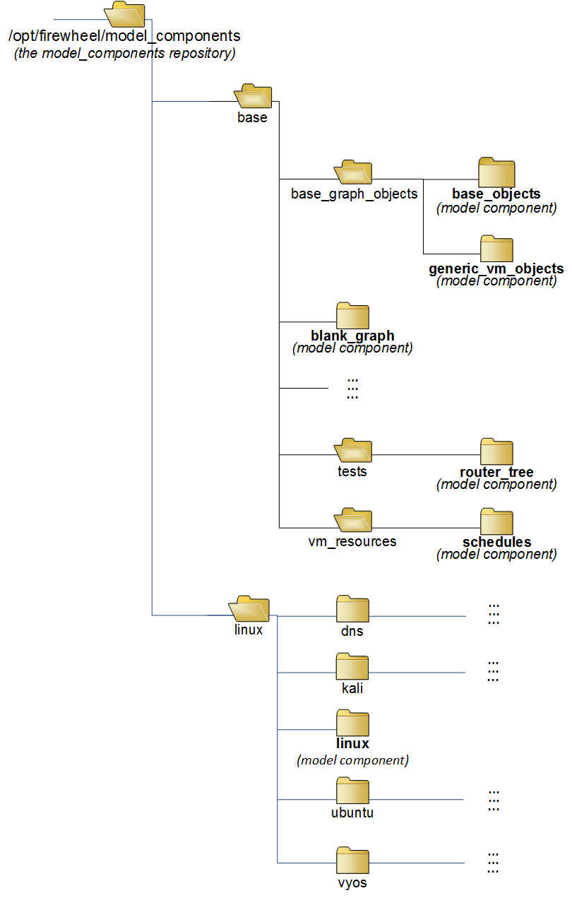

.. _repositories:

######################
FIREWHEEL Repositories
######################

In order for FIREWHEEL to identify available model components, model components must be stored in a "repository".
A repository is simply a directory that holds one or more :ref:`model_components` and is present on the head node of the FIREWHEEL cluster.
That is, its primary job is to inform FIREWHEEL where a set of :ref:`model_components` can be located.
Since version control is a software best practice, they are generally going to be either `git <https://git-scm.com/>`_ repositories and/or Python packages, but it is not required.
While installing a repository as a Python package is the easiest way to use repositories, users can also create and initialize a top-level folder (e.g., ``/opt/firewheel/model_components``) and clone/move any repositories into that folder.
Using this technique any model components that are located within this folder and any new Model Components added to it will accessible by FIREWHEEL.
Because installing Python packages and cloning various Model Component git repositories into ``/opt/firewheel/model_components`` is trivial, we expect that this feature will only be utilized by FIREWHEEL developers and administrators.

*****************************************
How FIREWHEEL Interacts with Repositories
*****************************************

When FIREWHEEL launches an experiment, it begins by traversing available repositories and searching for model components.
:numref:`Figure %s <fw_repo_ex>`, shows some of the contents and structure of the ``model_components`` repository that's included with FIREWHEEL.
Model components can be the direct children of a repository or nested within container parent folders (like the ``tests.router_tree`` model component).
However you organize the model components in a repository, FIREWHEEL will locate them when needed at run time.

Model components found within any of the installed repositories can be included as a dependency by other model components.
FIREWHEEL handles this dependency management automatically, thus enabling code reuse similar to how libraries or modules can be included in software programs written in C++ or Python.
In this way, model components within and across repositories can be linked together to create more powerful model components, and to build up full experiment topologies with scheduled activities.
For more information on model component dependencies, see :ref:`model_components`.

Since users can (and are encouraged to) create repositories containing one or more of their own experiment models, this eliminates the need for project specific code to be present in FIREWHEEL's main codebase.
If there are model components that are releasable or might be useful to others, we encourage users to publish them in a separate git repository and/or as a Python package.
The flexibility of a repository also provides a way to keep all your experiment specific model components in a single location (i.e. experiment topology definition, scheduled action executables, and VM images not already included with FIREWHEEL, etc.).

.. _fw_repo_ex:

   FIREWHEEL's ``model_components`` repository (partial) contents/structure.

.. _repository-creation:

********************************************
Installing a Repository into FIREWHEEL
********************************************

The easiest way to install a repository is via a Python package manager (e.g., `Pip <https://pypi.org/project/pip/>`_).

If the repository is not a Python package, once the repository is on the FIREWHEEL :ref:`cluster-control-node`, then the repository can be installed with the following command: ::

    $ firewheel repository install <path to repository directory>

Once installed (whether via a package manager or manually), all model components contained within a repository will be available for use.

*Some* Model Components may require additional Python packages to be installed or data to be downloaded.
In this case, the Model Component can have an ``INSTALL`` file, which can be any executable script (as denoted by a `shebang <https://en.wikipedia.org/wiki/Shebang_(Unix)>`_ line).
There are two ways in which these files can be executed:

#. Lazily when the model component is used in an experiment and FIREWHEEL determines that it hasn't been installed.
#. Proactively by calling The :ref:`helper_repository_install` Helper with the ``-s`` flag (see :ref:`helper_repository_install` for more details). This will iterate through all repositories and identify uninstalled model components and install them.

.. warning::

    The execution of Model Component ``INSTALL`` scripts can be a dangerous operation. Please ensure that you trust the repository developer prior to executing these scripts.

.. _repository-python-creation:

*******************************************
Converting a Repository to a Python Package
*******************************************

Similar to other frameworks (e.g., `Flake8 <https://flake8.pycqa.org/en/latest/plugin-development/registering-plugins.html>`_) FIREWHEEL uses `Entry Points <https://setuptools.pypa.io/en/latest/userguide/entry_point.html>`__ which are provided by `setuptools <https://setuptools.pypa.io/en/latest/index.html>`__.
This allows any package to register a new repository with FIREWHEEL.

We currently use the group ``firewheel.mc_repo`` to register a new repository.
In the example below (using a ``pyproject.toml`` file), we tell ``setuptools`` to register our entry point ``repo_path`` inside the group ``firewheel.mc_repo``.
While is does not matter the name of the variable ``repo_path``, the **value** does matter and **must** be ``<package_name>.__path__``.
This provides FIREWHEEL access to the actual location of the model components so that it can access non-Python related data such as the MANIFEST file or VM resources.

.. note::

    We also recommend that users use a tool like `setuptools-scm <https://pypi.org/project/setuptools-scm/>`_ to ensure all git-committed data is captured within the package.

.. code-block:: toml

    [build-system]
    requires = ["setuptools>=61.0", "setuptools_scm[toml]>=6.2"]
    build-backend = "setuptools.build_meta"

    [project]
    dynamic = ["version"]
    name = "firewheel_repository_name"
    authors = [
    { name="Example Author", email="author@example.com" },
    ]
    description = "A small example package"
    readme = "README.rst"
    requires-python = ">=3.9"
    classifiers = [
        "Programming Language :: Python :: 3",
        "License :: OSI Approved :: MIT License",
        "Operating System :: OS Independent",
    ]

    [tool.setuptools_scm]

    [project.entry-points."firewheel.mc_repo"]
    repo_path = "firewheel_repository_name:__path__"

With the previous ``toml`` file, the package can be built by running the following command in the top level Model Component directory:

.. code-block:: bash

    python -m build

This will create a ``.whl`` file in the ``dist`` directory, which can then be installed by running:

.. code-block:: bash

    cd dist
    python -m pip install <whl-file>

Alternatively, the package can be installed all at once by running the following command in the top level Model Component directory:

.. code-block:: bash

    python -m pip install .
