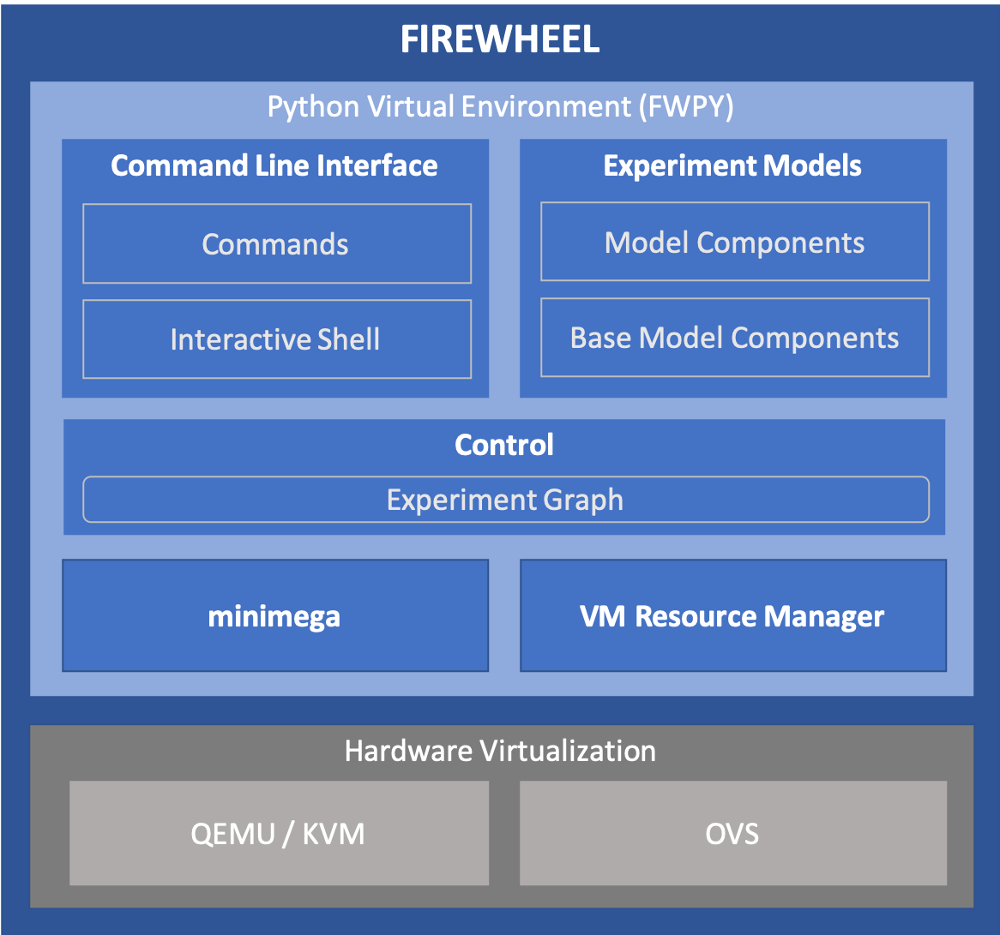

.. _FIREWHEEL-architecture:

Software  Architecture
======================

FIREWHEEL provides capabilities for the automated orchestration of VM deployments, virtual network provisioning, host/device application management, run time activity execution, and data collection for user defined cyber experiments.
To accomplish this, FIREWHEEL's *Control* system interprets user defined experiment models and interfaces with several open source technologies that handle things such as computer hardware virtualization, network virtualization, and persistent data storage, to name a few.

.. _fw_sw_arch:

   FIREWHEEL Software Architecture

FIREWHEEL's software architecture, as shown in :numref:`Figure %s <fw_sw_arch>`, consists of a Command Line Interface (CLI), Experiment Models, and three other major components (*Control*, minimega, and the *VM Resource Manager*) that convert experiment models into running experiments, and manage FIREWHEEL's VM deployment, virtual network and VM provisioning, and run time execution capabilities.
These FIREWHEEL software components are executed within a Python Virtual Environment, which we will refer to as ``fwpy``, and interact with the Hardware Virtualization components, QEMU/KVM and Open vSwitch (OVS), to instantiate experiment models as configured VMs communicating via virtual networks.
We'll next discuss each of FIREWHEEL's major software components.

.. note::
    For more detailed insight into how FIREWHEEL's components interact with one another, see the full :ref:`class_diagrams` and :ref:`package_diagrams`.

.. _command-line-interface:

Command Line Interface
----------------------

Users interact with FIREWHEEL's Command Line Interface (CLI) to task FIREWHEEL to execute its functions.
The CLI has a set of built in commands that users can use to do things like generate the CLI documentation and list available Helpers, as well as Helpers which extend the set of commands available through the CLI.
CLI commands and Helpers can be executed either directly from the console command line, or from within the CLI's own interactive shell environment. Since the CLI is designed to work with a FIREWHEEL cluster, its commands and Helpers will execute across cluster nodes to accomplish their tasks.
For more information about the commands and Helpers available via FIREWHEEL's CLI and how to use them, see the CLI documentation which is located in the CLI git repository.

.. _experiment-models:

Experiment Models
-----------------

Experiment models contain the details for all the elements to be included in a FIREWHEEL experiment.
This includes the definition of the experiment network topology, node and edge type definitions, VM assignments and specifications for each node in the topology and properties for every edge connection.
Experiment models can also contain VM resources, which are used to modify VMs after they've been launched, and the scheduling information that specifies where, when, and how each resource is to be used.

Model Components
^^^^^^^^^^^^^^^^

Model components are the building blocks of FIREWHEEL experiments.
Users build experiment models by creating and combining the sets of model components that define the topologies, attributes, configurations, and scheduled actions for their experiments.
Model components can depend on the outputs or capabilities of other model components, and ultimately the set of model components that make up a given experiment depend on model components provided by FIREWHEEL's Base Model Components repository.
For more information on Model Components, see :ref:`model_components`.

.. _control-system:

*Control*
---------

Once an experiment has been defined through a set of model components, it's ready to be launched and instantiated as VMs and virtual networks.
The first step in this process is to translate the experiment's model, as described by the model components that it's comprised of, into an internal in-memory representation of the experiment's network topology.
This internal experiment representation includes all the information that's needed for instantiating the experiment model on a virtualization platform.
This translation process is the job of FIREWHEEL's *Control* system, and the fully populated internal representation of an experiment is what it produces.

.. _experiment-graph:

Experiment Graph
^^^^^^^^^^^^^^^^

The output of the *Control* system (FIREWHEEL's internal, intermediate, run-time representation of an experiment) is called an experiment graph.
It's represented as a graph, with vertices and edges, to best provide an abstract representation of the experiment network topology the user wants instantiated as VMs and virtual network links.
The experiment graph contains all the information about each VM (the vertices) and the network connections amongst them (the edges) that were collectively specified in the experiment's set of model components.
Once constructed, the experiment graph will be passed to a virtualization management component that will instruct hardware virtualization systems to instantiate the experiment graph on a their platforms.
FIREWHEEL uses `NetworkX <https://networkx.org/>`_ [#netx]_, a Python library for studying graphs and networks, to implement an experiment graph.

.. [#netx] Aric A. Hagberg, Daniel A. Schult and Pieter J. Swart, `Exploring network structure, dynamics, and function using NetworkX <https://doi.org/10.25080/TCWV9851>`_, in `Proceedings of the 7th Python in Science Conference (SciPy2008) <https://doi.org/10.25080/PFVC8793>`_, Gäel Varoquaux, Travis Vaught, and Jarrod Millman (Eds), (Pasadena, CA USA), pp. 1-15, Aug 2008

.. _minimega:

minimega
--------

`minimega <https://www.sandia.gov/minimega/>`__, is the name of the virtualization management component that's currently available with FIREWHEEL. minimega will instantiate an experiment using QEMU/KVM for VMs, and OVS networks.
minimega receives an experiment graph from FIREWHEEL's *Control* system, then determines and sends the appropriate set of instructions to the QEMU/KVM hypervisor and OVS virtual networking systems that are needed to instantiate the experiment model as an emulated computer network.
At this stage the experiment network's topology has been fully instantiated on the virtualization platform, but has yet to have any of its scheduled actions applied to it -- which may further configure the compute systems and network devices as needed before beginning the intended cyber experiment.

.. _vm-resource-manager:

*VM Resource Manager*
---------------------

The last step in the process of launching a FIREWHEEL experiment is to monitor and manage the execution of any scheduled actions that need to be performed on the experiment network.
Scheduled actions can be separated into two temporal categories, pre and post experiment start.
Pre-start-time actions can be used to further configure VMs and networking prior to executing any experiment actions, and post-start-time actions can perform any number of actions needed for conducting the experiment.
The *VM Resource Manager* is the FIREWHEEL component that performs this job.
It receives the information about all actions that need to be performed (i.e. the vertices to perform them on, when they are to be performed, the commands, scripts or executables that need to be run, and/or any other resources required for accomplishing the action), and manages the execution of each action on each VM as required and at the designated time.
Once the *VM Resource Manager* has successfully finished monitoring and managing pre-start-time scheduled actions, then the experiment's emulated computer network is ready for conducting the intended experiment, and the *VM Resource Manager* will now do the same for actions that are scheduled to happen post-start-time i.e. actions that are part of the experiment.

Analytics
---------

Once the experiment is launched, gathering and analyzing experimental data becomes crucial.
To facilitate this process, FIREWHEEL provides seamless logging of VM resource output and generates JSON-formatted logs that can be easily ingested into data analysis tools such as Elasticsearch or Jupyter Notebooks.
After the data has been ingested into your preferred tool, users can visually display the experimental data or conduct analyses as needed.
