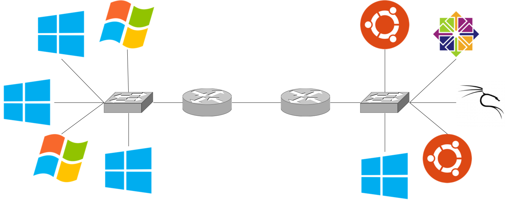
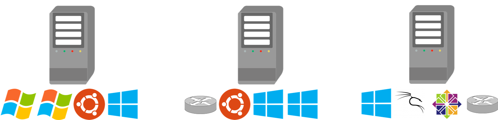

.. _FIREWHEEL-introduction:

###############
System Overview
###############
FIREWHEEL is a Sandia-developed experiment orchestration framework that assists an experimenter in building, controlling, observing, and analyzing repeatable experiments of distributed systems at any scale.
Typically, experiments are instantiated via emulation but fundamentally, FIREWHEEL is an experiment orchestration tool that is agnostic to how the experimental definition is converted into a running experiment and on to which execution platform(s) an experiment actually runs (i.e. bare metal, emulation, simulation, or a combination).
Most users of FIREWHEEL will be using emulation to launch experiments and this documentation will be tailored to those use cases; however it is important to note that is only one way in which FIREWHEEL can provide value in an Emulytics experiment.

An emulation-based experiment consists of a collection of virtual machines running operating system and application software connected by virtual networks.
The configuration of machines, software, and networks is driven by the design of the experiment, which in turn, is driven by the question the experiment has been designed to answer (see :ref:`Emulytics Experiments <emulytics-experiments>`).
FIREWHEEL enables users to define models of network topologies, as well as any time-scheduled actions they want performed on them.
At run-time, FIREWHEEL first represents a topology abstractly, using a graph data-structure, and then instantiates the topology across a :ref:`cluster <FIREWHEEL-cluster>` of network-connected servers and triggers the execution of scheduled actions at their appointed times.

.. _simple_topo:

   Simple example topology

For example, imagine an extremely simple experiment consisting of a collection of 10 PCs, running a variety of operating systems and applications, connected via a simple routed network as shown in :numref:`Figure %s <simple_topo>`.

.. _simple_schedule:

   VMs scheduled across a cluster for the simple topology example.

To implement this experiment, we can run a set of virtual machines distributed across three physical hosts as shown in :numref:`Figure %s <simple_schedule>`.
Lastly, we can execute some actions on those VMs which enable answering our research question.
For this simple experiment, it would be feasible to manually create and configure the virtual machine disk images, distribute them to the appropriate physical host machines, create the necessary virtual networks, start the virtual machines, and install, configure, and run software applications.
However, there are many shortcomings of manual configuration and FIREWHEEL was designed to overcome several of these.

**Scalability:** While configuring 10 virtual machines connected to a few networks manually is nontrivial, if an experiment required hundreds or thousands of virtual machines connected to a similar number of virtual networks, the task would quickly become overwhelming.

**Diversity:** If our question of interest requires us to test many variants of our initial configuration, for example to test the sensitivity of a system to a range of environmental parameters, manually managing the experimental complexity quickly becomes untenable.

**Repeatability:** If, months or years after we perform our experiments, we or other researchers wish to recreate our suite of experiments, a manual approach requires us to expend almost as much energy as during our original effort, even if excellent documentation is available.

**Coordination:** Experiments rarely consist of configuring and observing collections of idle virtual machines. Arranging the experimental events of interest to occur repeatably at precisely defined times across all the components of a manually defined experiment, especially if that experiment is large, is a challenge.

**Instrumentation and data collection:** Typically, the reason we run an experiment is to observe a system by collecting, storing, and analyzing detailed measurements. Reinventing this process anew for every manually constructed experiment is wasteful and error-prone.

FIREWHEEL enables users to conduct rigorous research to answer compelling questions about cyber environments while resolving the previously identified shortcomings of existing approaches.
Essentially, FIREWHEEL is a collection of tools that build upon several mature, open source virtualization and data management technologies. FIREWHEEL enables a researcher to:

- Define an experimental topology programmatically.
- Manipulate an experimental topology programmatically.
- Scalably "compile" the topology to a configured and running set of virtual machines and associated networks in a cluster.
- Manage the execution of in-experiment events and their data inputs and outputs.
- Pervasively instrument the virtual machines and networks involved in an experiment.
- Centrally collect, analyze, and display experimental data.
- Archive an experimental description and reliably repeat an experiment.

FIREWHEEL also includes a growing library of model component objects that ease construction of common topology components like Linux and Windows hosts, routers, Internet services, windows services, client and server applications, and a variety of example topologies ranging from small and simple to large and complicated that can be adapted or extended.

.. toctree::
   :hidden:

   infrastructure
   architecture
   diagrams
   security
