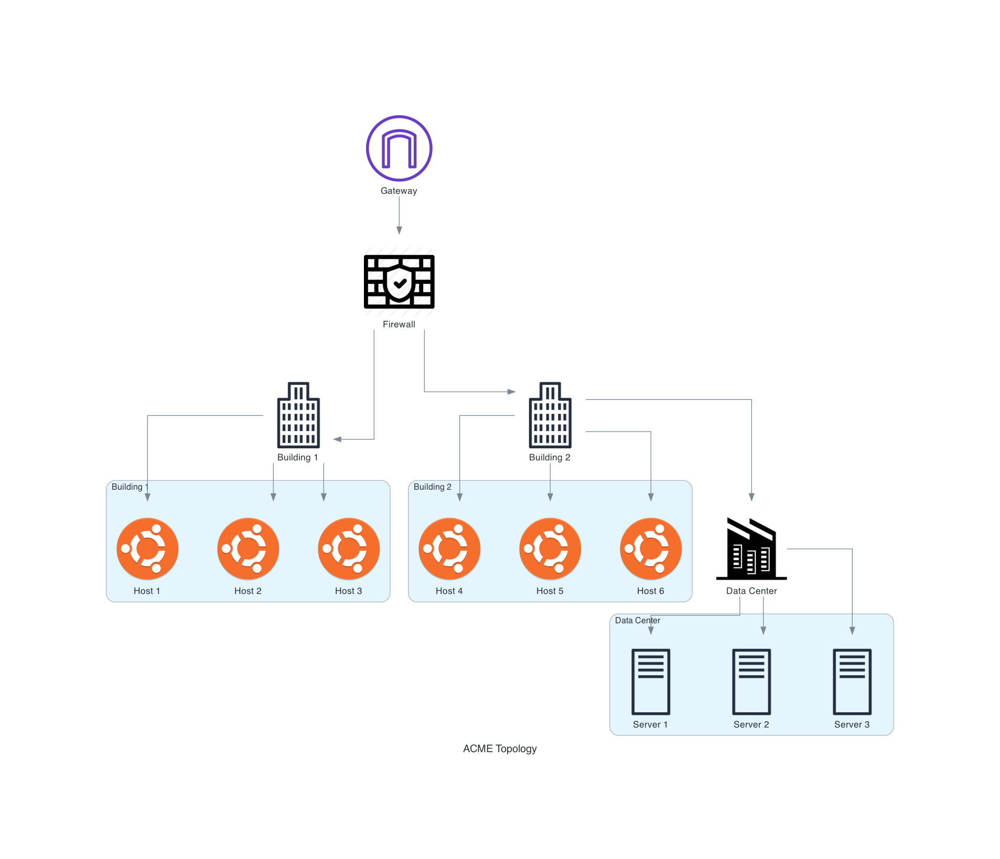
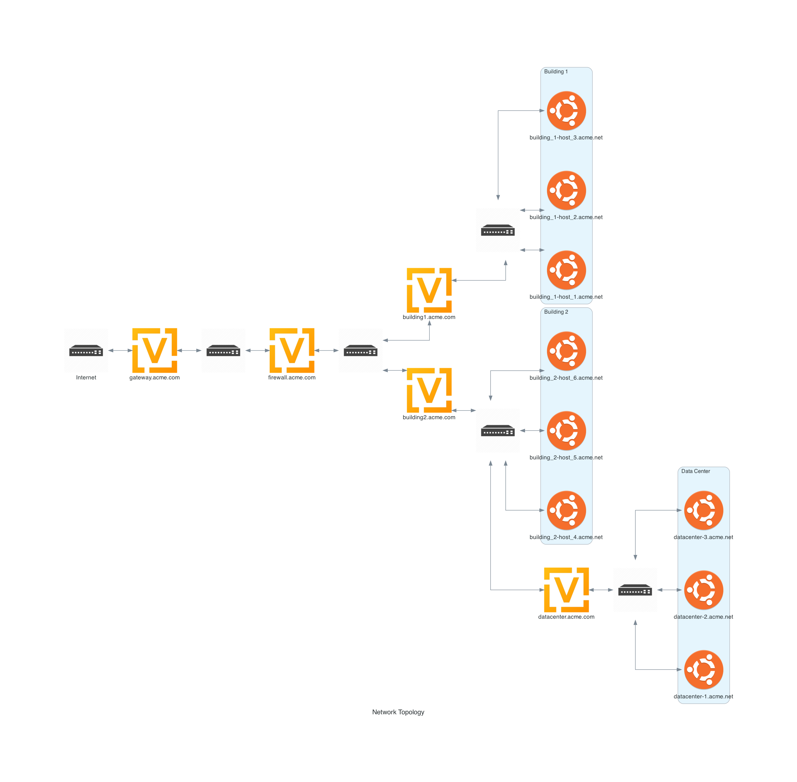

.. _acme-tutorial:

##############
ACME Tutorials
##############

This tutorial walks through creating a complex experiment in which users develop a prototypical corporate network and then verify that access controls for the data center are properly working.

The topology for the ACME Corporation is a simple, fictional enterprise that consists of a gateway, a firewall, two buildings, and a data center.

At a high-level the topology will look like:

.. _acme-getting-started:

***************
Getting Started
***************

Create a new directory called ``acme`` and install it as a FIREWHEEL repository.::

   $ mkdir acme
   $ firewheel repository install acme

.. seealso::

   For more information on installing repositories see: :ref:`repository-creation`.

Before creating any model components, we recommend that users think though the creation of this topology to understand how to translate the high-level objective into an experiment.

Some questions to answer before starting include:

#. How many Model Components (MCs) will I need/want?
#. Will my MCs have any dependencies?
#. What assumptions am I making about this experiment?
#. How will I validate my results?

How many model components will I need/want?
===========================================

Model components should each should accomplish one specific goal.
They should also be readable by others.
Lastly, they should be as reusable as possible.
That is, you should minimize future duplication of code.
Our objective is to ensure that the rules put in place on the *firewall* ensure that only hosts from *Building 2* can access the *data center* servers.
Given this exact scenario, we can likely accomplish this goal with a single model component.
However, this monolithic MC might be difficult to understand and will not be reusable.
Therefore, we recommend breaking this experiment into two distinct model components.
The first will contain the network topology.
This MC can now be used as a baseline for conducting other experiments with the ACME network.
The second MC will contain logic to add the firewall rules.

Will my MCs have any dependencies?
==================================

We have now determined that we need two model components.

Topology
--------

To understand what dependencies are needed, we need to first convert the high-level diagram into a network topology.

We can assume that both the gateway and firewall are routers.
Additionally, each building and the data center will need to route traffic.
We can assume that all workstations are running Ubuntu Desktop 22.04 and that the data center servers are Ubuntu Server 22.04.
Lastly, we will need several switches to help connect all the routers/hosts.
Here is what the network diagram will look like.

To build this topology, we will first need a model component which provides the :ref:`experiment-graph` attribute (e.g. ``graph``).

Once a graph is available to use, we will need to add vertices to that graph and then specify what kind of vertices they are.
For this topology, three types of vertices are will be used: :py:class:`Ubuntu2204Desktop <linux.ubuntu2204.Ubuntu2204Desktop>`, :py:class:`Ubuntu2204Server <linux.ubuntu2204.Ubuntu2204Server>`, and :py:class:`Helium118 <vyos.helium118.Helium118>`.
In order to be able to import those classes within the topology file we need to depend on the modules that provide them.
In this case, the :ref:`vyos.helium118_mc` and the :ref:`linux.ubuntu2204_mc` model components.
Additionally, we will need to connect our VMs to various :py:class:`Switches <base_objects.Switch>` to facilitate the network connectivity.
The :py:class:`Switch <base_objects.Switch>` object is provided by the :ref:`base_objects_mc` MC.
If you look at these model components you'll see the definitions for various model component objects which can be imported and used to help build out the experiment.

Based on our above analysis, we will depend on the ``graph`` attribute and the :ref:`base_objects_mc`, :ref:`vyos.helium118_mc`, and :ref:`linux.ubuntu2204_mc` model components.

Firewall Rules
--------------

For our MC which will install the firewall rules, we will need to depend on having a ``topology`` exist.

What assumptions am I making about this experiment?
===================================================

While it is almost impossible to identify *all* assumptions, it is always important to identify assumptions which might impact the validity of the experiment.
For this tutorial, the biggest assumption being made is that the OS types/versions may not be accurate.

**How will I validate my results?**

For this tutorial, we will leave the verification up to the user.
However, one test would be to trying pinging from ``building_1-host_1.acme.net`` to ``datacenter-1.acme.net`` before installing the firewall rules to ensure connectivity and then once after installing the rules to ensure connectivity has been lost.

*********************
Building the Topology
*********************

.. toctree::
   :maxdepth: 2

   acme/acme_manifest.rst
   acme/acme_topology.rst
   acme/running_acme_topology.rst
   acme/acme_vm_configuration.rst
   acme/acme_complexity.rst
