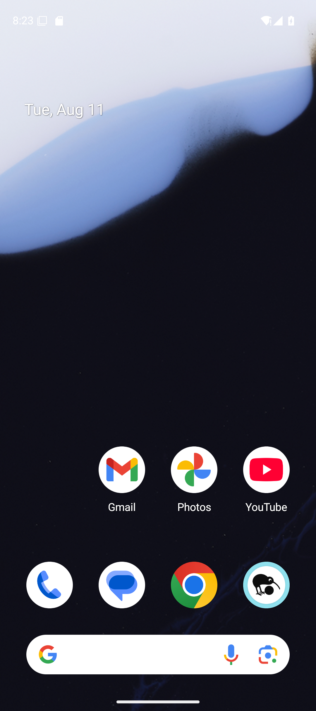
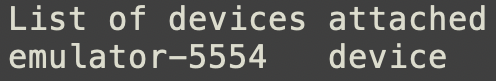
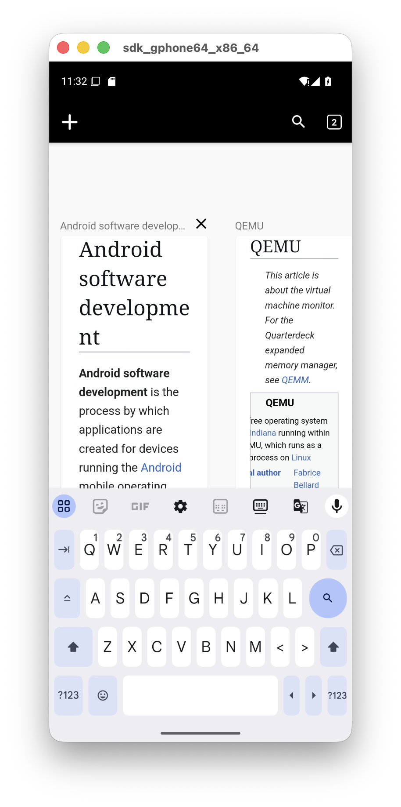

.. _android-app-automation:

********************************
Automation and Reviewing Outputs
********************************

In the previous section, we launched the Android VM, installed Kiwix, and staged
the offline ZIM file. In this section, we will add a Maestro flow, relaunch the
experiment, and review the resulting artifacts.

Create the Maestro Kiwix Flow
=============================

Create a Maestro flow named ``kiwix_setup_and_load.yaml`` in the tutorial model
component's ``vm_resources`` directory:

.. code-block:: yaml
    :caption: vm_resources/kiwix_setup_and_load.yaml

    appId: org.kiwix.kiwixmobile.standalone
    ---
    - launchApp

    - waitForAnimationToEnd

    - extendedWaitUntil:
        visible: "GET STARTED"
        timeout: 30000

    - tapOn: "GET STARTED"

    - waitForAnimationToEnd

    - extendedWaitUntil:
        visible: "Library"
        timeout: 30000

    - extendedWaitUntil:
        visible: "No files here"
        timeout: 30000

    - tapOn:
        id: "org.kiwix.kiwixmobile.standalone:id/select_file"

    - extendedWaitUntil:
        visible: "Show roots"
        timeout: 30000

    - tapOn: "Show roots"

    - extendedWaitUntil:
        visible: "sdk_gphone64_x86_64"
        timeout: 30000

    - tapOn: "sdk_gphone64_x86_64"

    - extendedWaitUntil:
        visible: "Download"
        timeout: 30000

    - tapOn: "Download"

    - extendedWaitUntil:
        visible: "Kiwix"
        timeout: 30000

    - tapOn: "Kiwix"

    - extendedWaitUntil:
        visible: "wikipedia_en_computer_nopic_2026-06.zim"
        timeout: 30000

    - tapOn: "wikipedia_en_computer_nopic_2026-06.zim"

    - waitForAnimationToEnd

    - takeScreenshot: kiwix-loaded-computer

This flow launches Kiwix, handles the first-run screen, opens the Android file
picker, selects the staged ZIM file, waits for the content to load, and takes a
screenshot.

The ``select_file`` step taps the file-selection button on the Kiwix Library
screen. In this Kiwix version, that button does not have visible text, so the
flow uses its Android resource ID:

.. code-block:: yaml

    - tapOn:
        id: "org.kiwix.kiwixmobile.standalone:id/select_file"

.. warning::

   Mobile app UIs change over time. If this flow fails, use ``scrcpy`` to inspect
   the current UI and update the text selectors as needed. Depending on the Kiwix
   version and Android system UI, the file picker may use slightly different
   labels.

Update the Plugin
=================

Replace ``plugin.py`` with this version:

.. code-block:: python
    :caption: plugin.py

    from android.pixel9a import AndroidPixel9a
    from android.maestro import AndroidMaestroEndpoint

    from firewheel.control.experiment_graph import Vertex, AbstractPlugin

    class Plugin(AbstractPlugin):
        """
        Android application analysis tutorial topology.

        This version launches one Android Pixel 9a emulator, installs Kiwix,
        stages an offline ZIM file, runs a Maestro setup/load flow, and collects
        the Kiwix application data directory.
        """

        def run(self):
            """
            Build the Android application analysis experiment.
            """
            phone = Vertex(self.g, name="android-phone")
            phone.decorate(AndroidPixel9a)
            phone.decorate(AndroidMaestroEndpoint)

            # Installing the Kiwix app
            phone.install_apk(
                start_time=-50,
                filenames="org.kiwix.kiwixmobile.standalone.apk",
            )

            # Ensure the directories are available
            phone.run_executable(
                -40,
                "/system/bin/mkdir",
                ["-p", "/sdcard/Download/Kiwix"],
                vm_resource=False,
            )

            # Copy the offline Wikipedia ZIM file to shared storage.
            phone.drop_file(
                -30,
                "/sdcard/Download/Kiwix/wikipedia_en_computer_nopic_2026-06.zim",
                "wikipedia_en_computer_nopic_2026-06.zim",
            )

            # Use Maestro to load the staged ZIM file in Kiwix.
            phone.add_maestro_flow(
                start_time=10,
                flow_resource="kiwix_setup_and_load.yaml",
                timeout=180,
                fail_experiment_on_failure=False,
            )

            # Export the application information for analysis
            phone.file_transfer_once(
                location="/data/data/org.kiwix.kiwixmobile.standalone",
                start_time=220,
                destination=None,
            )

This adds two actions:

:py:meth:`add_maestro_flow <android.maestro.AndroidMaestroEndpoint.add_maestro_flow>`
    Runs the Maestro flow against the Android VM.

:py:meth:`file_transfer_once <base_objects.VMEndpoint.file_transfer_once>`
    Collects ``/data/data/org.kiwix.kiwixmobile.standalone`` after the Maestro
    timeout window.

.. note::
    
    The file transfer is scheduled at time ``220`` so it does not "race" with the Maestro flow, which starts at time ``10`` and has a timeout of ``180`` seconds.

Relaunch the Experiment
=======================

Relaunch the experiment:

.. code-block:: bash

    firewheel experiment -r tutorials.android_app_analysis minimega.launch

Wait for the Android VM to boot, install the APK, stage the ZIM file, run the
Maestro flow, and collect the application data.

You can watch the VM resource log while the experiment configures:

.. code-block:: bash

    tail -f /scratch/firewheel/vm_resource_logs/android-phone.log

Review Maestro Artifacts
========================

The Maestro artifacts are written under:

.. code-block:: text

    /scratch/firewheel/vm_resource_logs/maestro/android-phone/kiwix_setup_and_load/<timestamp>/

For example, one run might create:

.. code-block:: text

    /scratch/firewheel/vm_resource_logs/maestro/android-phone/kiwix_setup_and_load/20260811T180128Z/

The timestamp changes on every run, so we recommend using `find <https://linux.die.net/man/1/find>`_ rather than hard-coding the
directory name.

A typical artifact tree looks like this:

.. code-block:: text

    /scratch/firewheel/vm_resource_logs/maestro/android-phone/
    └── kiwix_setup_and_load/
        └── <timestamp>/
            ├── adb_devices.txt
            ├── adb_version.txt
            ├── after_getprop.txt
            ├── after_screenshot.png
            ├── after_window.txt
            ├── before_getprop.txt
            ├── before_screenshot.png
            ├── before_window.txt
            ├── command.json
            ├── command.txt
            ├── exit_code.txt
            ├── flow.yaml
            ├── maestro_stderr.txt
            ├── maestro_stdout.txt
            ├── maestro_version.txt
            ├── resolved_device.txt
            ├── resolved_paths.json
            ├── result.json
            └── runner_input.json

The most readable file is often ``maestro_stdout.txt`` because it shows each
Maestro step and whether that step completed.

View the most recent Maestro stdout:

.. code-block:: bash

    cat $(find /scratch/firewheel/vm_resource_logs/maestro/android-phone/kiwix_setup_and_load -name maestro_stdout.txt | sort | tail -n 1)

Example output:

.. code-block:: text

    Running on Pixel_9a
     > Flow kiwix_setup_and_load
    Launch app "org.kiwix.kiwixmobile.standalone"... COMPLETED
    Wait for animation to end... COMPLETED
    Assert that "GET STARTED" is visible... COMPLETED
    Tap on "GET STARTED"... COMPLETED
    Wait for animation to end... COMPLETED
    Assert that "Library" is visible... COMPLETED
    Assert that "No files here" is visible... COMPLETED
    Tap on id: org.kiwix.kiwixmobile.standalone:id/select_file... COMPLETED
    Assert that "Show roots" is visible... COMPLETED
    Tap on "Show roots"... COMPLETED
    Assert that "sdk_gphone64_x86_64" is visible... COMPLETED
    Tap on "sdk_gphone64_x86_64"... COMPLETED
    Assert that "Download" is visible... COMPLETED
    Tap on "Download"... COMPLETED
    Assert that "Kiwix" is visible... COMPLETED
    Tap on "Kiwix"... COMPLETED
    Assert that "wikipedia_en_computer_nopic_2026-06.zim" is visible... COMPLETED
    Tap on "wikipedia_en_computer_nopic_2026-06.zim"... COMPLETED
    Wait for animation to end... COMPLETED
    Take screenshot kiwix-loaded-computer... COMPLETED

You can also view the machine-readable result:

.. code-block:: bash

    cat $(find /scratch/firewheel/vm_resource_logs/maestro/android-phone -name result.json | sort | tail -n 1)

A successful run should have a ``result.json`` similar to:

.. code-block:: json

    {
      "artifacts": {
        "adb_devices": "adb_devices.txt",
        "after_screenshot": "after_screenshot.png",
        "after_window": "after_window.txt",
        "before_screenshot": "before_screenshot.png",
        "before_window": "before_window.txt",
        "command": "command.txt",
        "command_json": "command.json",
        "exit_code": "exit_code.txt",
        "flow": "flow.yaml",
        "resolved_device": "resolved_device.txt",
        "resolved_paths": "resolved_paths.json",
        "runner_input": "runner_input.json",
        "stderr": "maestro_stderr.txt",
        "stdout": "maestro_stdout.txt"
      },
      "device": "emulator-5554",
      "duration_seconds": 61.90870464127511,
      "end_time_utc": "2026-08-11T19:19:51Z",
      "fail_experiment_on_failure": false,
      "flow_label": "kiwix_setup_and_load",
      "flow_resource": "kiwix_setup_and_load.yaml",
      "maestro_exit_code": 0,
      "runner_exit_code": 0,
      "start_time_utc": "2026-08-11T19:18:49Z",
      "status": "pass",
      "timed_out": false,
      "tool": "maestro",
      "vm_name": "android-phone"
    }

The exact timestamps, duration, and ADB serial will differ between runs.

Important Maestro files include:

.. list-table::
   :header-rows: 1

   * - File
     - Description
   * - ``maestro_stdout.txt``
     - Step-by-step Maestro output.
   * - ``result.json``
     - Machine-readable status summary.
   * - ``resolved_device.txt``
     - Runtime ADB serial used by the flow.
   * - ``command.txt``
     - Exact Maestro command.
   * - ``maestro_stderr.txt``
     - Maestro standard error.
   * - ``before_screenshot.png``
     - Screenshot before the flow.
   * - ``after_screenshot.png``
     - Screenshot after the flow.
   * - ``flow.yaml``
     - Copy of the flow that was executed.

   Example screenshot captured before the Maestro flow ran.

   Example screenshot captured after the Maestro flow ran.

Review Collected Application Data
=================================

The plugin collected:

.. code-block:: text

    /data/data/org.kiwix.kiwixmobile.standalone

In the default tutorial environment, FIREWHEEL writes transferred files under:

.. code-block:: text

    /scratch/firewheel/transfers/

For this tutorial, the collected data should be located at:

.. code-block:: text

    /scratch/firewheel/transfers/android-phone/data/data/org.kiwix.kiwixmobile.standalone

Check that the directory exists:

.. code-block:: bash

    ls -lah /scratch/firewheel/transfers/android-phone/data/data/org.kiwix.kiwixmobile.standalone

Manual Debugging with scrcpy
============================

`scrcpy <https://github.com/Genymobile/scrcpy>`_ is useful when automation fails
or when you need to interact with the phone manually.

First identify the runtime ADB serial:

.. code-block:: bash

    adb devices

   Example ``adb devices`` output. The emulator serial shown here is only an
   example; always use the serial reported in your experiment.

Start ``scrcpy``:

.. code-block:: bash

    scrcpy -s <adb-serial> --no-audio

For example:

.. code-block:: bash

    scrcpy -s emulator-5554 --no-audio

   Example ``scrcpy`` view of the Android emulator after launching Kiwix.

.. note::

   If the Android emulator is running on a remote minimega host, forward both
   the Android console port and the ADB port before using local ADB or
   ``scrcpy``. For example, if minimega reports console port ``5554`` and ADB
   port ``5555``:

   .. code-block:: bash

      ssh \
        -L 127.0.0.1:5554:127.0.0.1:5554 \
        -L 127.0.0.1:5555:127.0.0.1:5555 \
        fw-server

If ``scrcpy`` cannot find the device, restarting the local ADB server often
helps:

.. code-block:: bash

    adb kill-server
    adb start-server
    adb devices
    scrcpy -s <adb-serial> --no-audio

Troubleshooting
===============

APK install fails
-----------------

Check the VM resource log:

.. code-block:: bash

    tail -n 100 /scratch/firewheel/vm_resource_logs/android-phone.log

Common causes are a missing APK, a filename mismatch, an incompatible APK, or a
split APK provided as if it were a complete APK.

ZIM file is missing
-------------------

Check the staged file on the device:

.. code-block:: bash

    adb -s <adb-serial> shell ls -lh /sdcard/Download/Kiwix

If it is missing, verify that
``wikipedia_en_computer_nopic_2026-06.zim`` exists in ``vm_resources/`` and
matches the filename in ``plugin.py``.

Maestro flow fails
------------------

Inspect the most recent stdout, stderr, and screenshots:

.. code-block:: bash

    find /scratch/firewheel/vm_resource_logs/maestro/android-phone -name maestro_stdout.txt -print
    find /scratch/firewheel/vm_resource_logs/maestro/android-phone -name maestro_stderr.txt -print

Common causes include changed UI text, a different Android file-picker label, or
a wait that is too short. Use ``scrcpy`` and the UI hierarchy dump to update
``kiwix_setup_and_load.yaml``.

To inspect the Android UI hierarchy:

.. code-block:: bash

    adb -s <adb-serial> shell uiautomator dump /sdcard/window.xml
    adb -s <adb-serial> pull /sdcard/window.xml
    grep -i -E "text=|content-desc=|resource-id=|clickable=\"true\"" window.xml

Collected data is missing
-------------------------

Check the VM resource logs and the expected transfer directory:

.. code-block:: bash

    ls -lah /scratch/firewheel/transfers/android-phone/data/data/org.kiwix.kiwixmobile.standalone

Next Steps
==========

At this point, you have a working Android experiment that installs an APK,
stages offline content, uses Maestro to load that content, and collects
application data.

Continue to :ref:`android-app-analysis` if you want to inspect the collected
Kiwix files.
