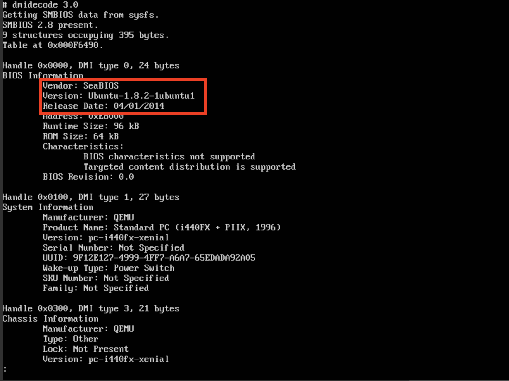
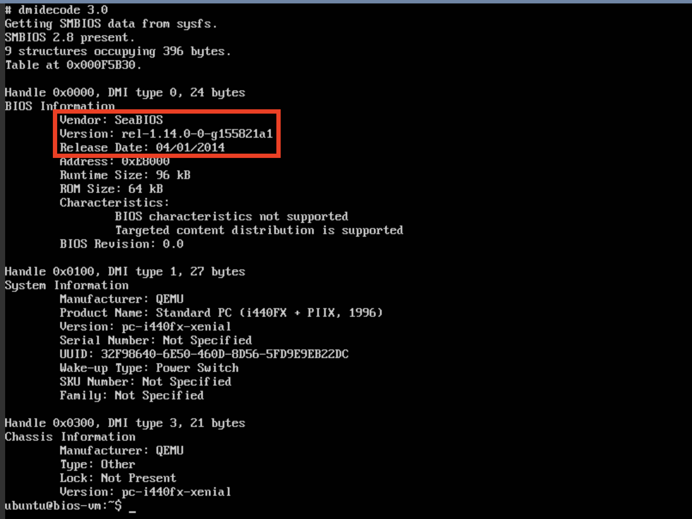

.. _bios-tutorial:

###################
Using a Custom BIOS
###################

In this tutorial we will demonstrate how to launch a VM with a custom BIOS image.
To keep things simple, we will launch an experiment with a single VM and use the open source `SeaBIOS <https://www.seabios.org/SeaBIOS>`_ as the BIOS image.

.. note::
    If the custom BIOS will be generally useful for more experiments, it should likely be contained in its own model component. However, to keep our tutorial easy/short, we will put both the topology and BIOS image in the same MC.

.. _bios-mc-setup:

*********************
Model Component Setup
*********************

First, we will create our new Model Component using the :ref:`helper_mc_generate` command:

.. code-block:: bash

    $ firewheel mc generate
    (name) ModelComponent name : tutorials.bios
    (attribute_depends) (space-separated-strings) Graph Attribute(s) depended on by the new ModelComponent []: graph
    (attribute_provides) (space-separated-strings) Graph Attribute(s) provided by the new ModelComponent []: topology
    (attribute_precedes) (space-separated-strings) Graph Attribute(s) preceded by the new ModelComponent []:
    (model_component_depends) (space-separated-strings) ModelComponent(s) required by name []: base_objects linux.ubuntu1604
    (model_component_precedes) (space-separated-strings) ModelComponent(s) that will be preceded by name []:
    (plugin) File for a plugin []: plugin.py
    (model_component_objects) File for Model Component Objects []:
    (location) Location for the new ModelComponent : /opt/firewheel/model_components/bios
    (vm_resources) (space-separated-strings) File(s) to be used as a vm_resource []:
    (image) File to be used as a VM disk []: images/bios.bin.tar.gz
    (arch) Architecture for specified image []: x86_64

We now need to add that repository to FIREWHEEL by using the :ref:`helper_repository_install` Helper.

.. code-block:: bash

    $ firewheel repository install /opt/firewheel/model_components/bios
    Repository successfully installed!

Then we will create a new folder in our MC folder (``/opt/firewheel/model_components/bios``) called "images".

.. code-block:: bash

    $ cd /opt/firewheel/model_components/bios
    $ mkdir images

.. note::

    We didn't *need* to create an "images" folder for the BIOS, but doing so is best practice for Model Component organization.

Then we will download the latest SeaBIOS image (see https://www.seabios.org/downloads/) into the folder.
This will make the image available to FIREWHEEL (as specified in our MANIFEST file.
After downloading, we will rename the file because QEMU requires the BIOS to have the ``.bin`` extension.
Additionally, we will use tar+gzip which can be automatically decompressed by FIREWHEEL.

.. code-block:: bash

    $ cd images
    $ wget https://www.seabios.org/downloads/bios.bin-1.14.0.gz
    $ gunzip bios.bin-1.14.0.gz
    $ mv bios.bin-1.14.0 bios.bin
    $ tar -czvf bios.bin.tar.gz bios.bin

.. note::
    For offline users or those whom may have issues reaching the Internet due to various network security devices (e.g. proxies, firewalls, etc.) an alternative method (or various ``wget`` options) for downloading the file may be necessary.

*****************
Topology Creation
*****************

Now that we have all the pieces in place, we will create our very simple topology by editing ``plugin.py``.
Because we only need to create a single VM, this will be very simple.
The new ``plugin.py`` file should look like:

.. code-block:: python

    from firewheel.control.experiment_graph import AbstractPlugin, Vertex

    from linux.ubuntu1604 import Ubuntu1604Server

    class Plugin(AbstractPlugin):
        """tutorials.bios plugin documentation."""

        def run(self):
            """Create a single VM and add a custom BIOS for it."""
            vm = Vertex(self.g, "bios-vm")
            vm.decorate(Ubuntu1604Server)

Before we add the custom BIOS, we should ensure that the image has a different BIOS to compare before/after.

Let's launch an experiment to locate our current BIOS.

.. code-block:: bash

    $ firewheel experiment tutorials.bios minimega.launch

Once the experiment has configured, we can log into the VM using miniweb and run the following command::

    $ sudo dmidecode | less

Now, we can modify the ``plugin.py`` to make the VM use our new BIOS.
Add the following line:

.. code-block:: python

    bios_vm.vm['bios'] = "bios.bin"

.. note::
    FIREWHEEL will automatically extract the image from the tar compression, which is why you omit the ``.tar.gz`` extension.

Now we can relaunch the experiment:

.. code-block:: bash

    $ firewheel experiment -f tutorials.bios minimega.launch

Once we log into the VM, we should see that the BIOS has changed.

