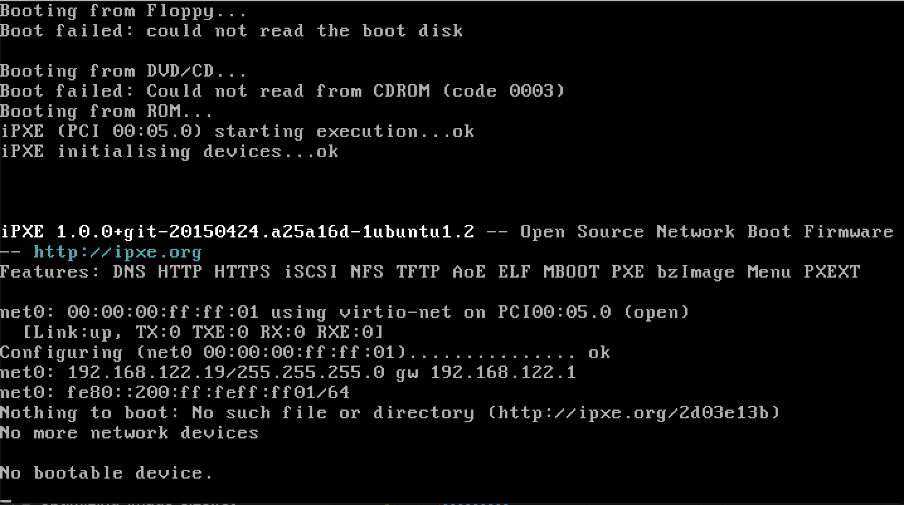
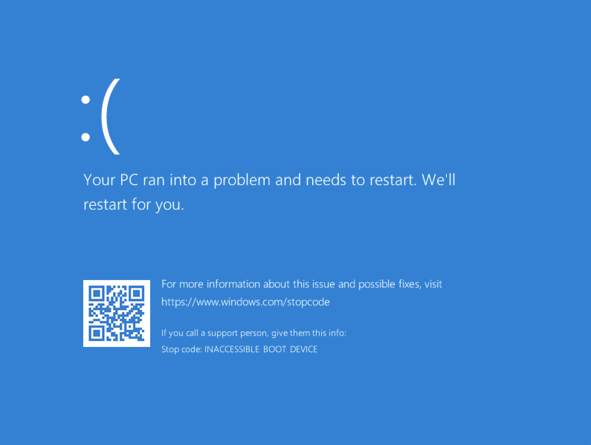

.. _troubleshooting_images:

##########################
Troubleshooting New Images
##########################

******************
No Bootable Device
******************

**Symptoms:** The image cannot cannot read the boot disk.

While this can be caused by a number of different issues, the most common problem is that the image was created with a BIOS that is incompatible with QEMU, for example UEFI.
This BIOS issue typically happens with Windows images created using consumer virtualization tools, such as VMWare, VirtualBox, etc. which are then converted into a QCOW2 image.
For UEFI, you may need to install Open Virtual Machine Firmware (OVMF).
We have found that the following instructions useful: https://www.ubuntubuzz.com/2021/04/how-to-boot-uefi-on-qemu.html.

The easiest solution is to initially create the image using the "Legacy BIOS" option.
Alternatively, if you require a different BIOS for your image, FIREWHEEL enables you to provide the BIOS firmware to QEMU.
For more information on this technique, please see the :ref:`bios-tutorial` tutorial.

********************************
Windows Inaccessible Boot Device
********************************

**Symptoms:** The Windows image will show the error "INACCESSIBLE BOOT DEVICE".

We have found that this issue can occur if the image does not have `VirtIO <https://www.linux-kvm.org/page/Virtio>`_ drivers installed correctly (see this post: https://superuser.com/q/1057959).
To test that this is the case, re-launch the image but ensure VirtIO is not turned on for the disk drive.
That is, remove ``if=virtio`` from the drive parameter:

.. code-block:: bash
    :caption: Remove ``,if=virtio`` from this line.

    -drive file=image.qcow2,if=virtio,cache=writeback

.. code-block:: bash
    :caption: The final ``drive`` parameter.

    -drive file=image.qcow2,cache=writeback

If users create Windows images using COTS tools like VMWare, we recommend that you follow this specific procedure.

1. Create a fake (dummy) disk with:

    .. code-block:: bash

        $ qemu-img create -f qcow2 fake.qcow2 1G

2. Download the VirtIO Driver ISO from https://fedorapeople.org/groups/virt/virtio-win/direct-downloads/stable-virtio/virtio-win.iso
3. Re-launch the image where the Windows boot drive is *NOT* using ``if=virtio`` and add the new fake drive as a secondary drive, but the driver for that one *should* be ``virtio``.
   That is, using QEMU, you would add the parameter ``-drive file=fake.qcow2,if=virtio``.
   Additionally, ensure that you mount the ``virtio-win.iso`` (e.g. adding something like ``-drive file=virtio-win.iso,index=2,media=cdrom`` to the command.
4. Use the VirtIO Windows installer to install all the VirtIO drivers.
5. Once installed, shut down the VM.
6. To verify that it worked, re-add ``if=virtio`` to the windows disk command, remove the fake drive and the ``virtio-win.iso`` from the QEMU command.
   It should now boot successfully!

.. note::
    These instructions were adapted from https://superuser.com/a/1532612 and https://wiki.archlinux.org/title/QEMU#Virtio_drivers_for_Windows. If the issue persists, we recommend attempting other solutions found in the following thread: https://superuser.com/q/1057959.

*********************************
VM Resources Are Not Being Loaded
*********************************

**Symptoms:** If, when launching your FIREWHEEL experiment, the VM Resources are not being loaded into the VM.
By checking the VM Resource logs (see :ref:`vmr-output`), you may see errors such as::

    Traceback (most recent call last):
    File "/opt/firewheel/src/firewheel/vm_resource_manager/drivers/qemu_guest_agent_driver.py", line 819, in write_from_file
        "guest-file-open", {"path": filename, "mode": mode}
    ...
    OSError: cannot read from timed out object
    [2021-07-19 18:11:45 GMT ERROR] UNABLE TO WRITE FILE

This could mean that the permissions on the disk image are incorrect.
The disk must be readable *and* writable.
If your disk is compressed, verify that when it is extracted it has both read/write permissions set.
You can use the command:

.. code-block:: bash

    $ chmod 666 image.qcow2

If the permissions are wrong, you should :ref:`clear the image cache <helper_mm_clear_cache>` to ensure that the new permissions take effect.

.. code-block:: bash

    $ firewheel mm clear_cache images
