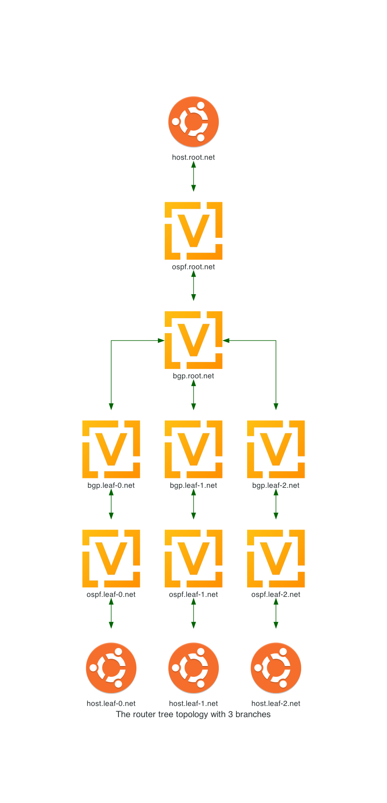

.. _router-tree-tutorial:

################################
Running the Router Tree Topology
################################

This tutorial demonstrates how to run a simple test topology using FIREWHEEL.
The topology is part of the FIREWHEEL functional testing suite.

************
The Topology
************

As the name suggests, this topology creates a tree.
The leaves of the tree are subnets that include a variable number of host endpoints and have a single gateway router.
The routers at the leaf subnets use OSPF to advertise connectivity of their endpoints.
The leaf routers then redistribute their OSPF routes to upstream BGP routers, eventually culminating in the BGP router at the root of the topology tree.

The topology takes one parameter which specifies the desired number of OSPF branches.
The following diagram depicts the result of running the router tree topology with a parameter of three.

********************
Running the Topology
********************

1. Before running a new topology, it's always good to ensure that your environment is clean.
   Therefore, restart FIREWHEEL::

    $ firewheel restart

#. The router tree topology is located within the FIREWHEEL's ``base`` git repository and depends on VM images found in the ``linux`` git repository.
   If those have not been installed, please do so before continuing.
   You can review :ref:`repositories` for more details.
   To quickly verify if we have all the necessary MCs available, we can use the :ref:`helper_mc_list` command.
   We need to ensure that both :ref:`tests.router_tree_mc` and :ref:`linux.base_objects_mc` are installed ::

    $ firewheel mc list -k name=tests.router_tree
    repository : /opt/firewheel/model_components
        tests.router_tree
    $ firewheel mc list -k name=linux.base_objects
    repository : /opt/firewheel/model_components
        linux.base_objects

   If both MCs are available, the router tree topology is ready to be run.

#. Use the following command to kick off the router tree topology:

   .. code-block:: bash

       $ firewheel experiment tests.router_tree:3 minimega.launch

   This may take a bit of time as FIREWHEEL needs to "upload" the images used in the topology.
   Future runs will be much quicker as the images will have been cached.
   You will see the list of Model Components that were run to create the topology and the time each Model Component consumed:

   .. code-block:: bash

                           Model Components Executed
        ┏━━━━━━━━━━━━━━━━━━━━━━━━━━━━━━━━━┳━━━━━━━━━━━━┳━━━━━━━━━━━━━━━┓
        ┃      Model Component Name       ┃   Result   ┃    Timing     ┃
        ┡━━━━━━━━━━━━━━━━━━━━━━━━━━━━━━━━━╇━━━━━━━━━━━━╇━━━━━━━━━━━━━━━┩
        │ base_objects                    │         OK │ 0.010 seconds │
        │ generic_vm_objects              │         OK │ 0.000 seconds │
        │ linux.base_objects              │         OK │ 0.027 seconds │
        │ misc.blank_graph                │         OK │ 0.002 seconds │
        │ tests.router_tree               │         OK │ 0.007 seconds │
        │ minimega.emulated_entities      │         OK │ 0.003 seconds │
        │ minimega.testbed_available      │         OK │ 0.028 seconds │
        │ linux.ubuntu                    │         OK │ 0.025 seconds │
        │ linux.ubuntu1604                │         OK │ 0.017 seconds │
        │ vyos                            │         OK │ 0.020 seconds │
        │ vyos.helium118                  │         OK │ 0.019 seconds │
        │ minimega.create_mac_addresses   │         OK │ 0.004 seconds │
        │ minimega.resolve_vm_images      │         OK │ 0.023 seconds │
        │ minimega.configure_ips          │         OK │ 0.002 seconds │
        │ minimega.send_miniweb_arp       │         OK │ 0.001 seconds │
        │ minimega.schedules_ready        │         OK │ 0.000 seconds │
        │ vm_resource.schedule            │         OK │ 0.056 seconds │
        │ vm_resource.validate            │         OK │ 0.019 seconds │
        │ minimega.parse_experiment_graph │         OK │ 3.429 seconds │
        │ minimega.launch                 │         OK │ 0.000 seconds │
        ├─────────────────────────────────┼────────────┼───────────────┤
        │                                 │ Total Time │ 4.922 seconds │
        └─────────────────────────────────┴────────────┴───────────────┘
                    Dependency resolution took 1.159 seconds

#. Now that the experiment is running, use the :ref:`helper_vm_mix` command to see the mix of VM images running and their current states:

   .. code-block:: bash

       $ firewheel vm mix
                                           VM Mix
       ┏━━━━━━━━━━━━━━━━━━━━━━━━━━━━━━━━━━━┳━━━━━━━━━━━━━┳━━━━━━━━━━━━━━━━━━━┳━━━━━━━┓
       ┃ VM Image                          ┃ Power State ┃ VM Resource State ┃ Count ┃
       ┡━━━━━━━━━━━━━━━━━━━━━━━━━━━━━━━━━━━╇━━━━━━━━━━━━━╇━━━━━━━━━━━━━━━━━━━╇━━━━━━━┩
       │ ubuntu-16.04.4-server-amd64.qcow2 │ RUNNING     │ configured        │ 4     │
       ├───────────────────────────────────┼─────────────┼───────────────────┼───────┤
       │ vyos-1.1.8.qc2                    │ RUNNING     │ configured        │ 8     │
       ├───────────────────────────────────┼─────────────┼───────────────────┼───────┤
       │                                   │             │ Total Scheduled   │ 12    │
       └───────────────────────────────────┴─────────────┴───────────────────┴───────┘

   As the *VM Resource Manager* connects to the VMs and the VMs begin to run configuration resources the states will change from ``uninitialized`` to ``configuring`` and finally to ``configured``.

#. To watch the progress of a single VM's configuration you can look at its log file.
   Information printed to both ``stdout`` and ``stderr`` by VM resources are written to the VM's log.
   All VM log files are located in the :ref:`vmr_log_dir <config-vmr_log_dir>` on the compute node where the VM is located.
   To locate this directory we can use:

   .. code-block:: bash

       $ firewheel config get logging.root_dir
       /tmp/firewheel
       $ firewheel config get logging.vmr_log_dir
       vm_resource_logs

   Therefore, in this example, the logs can be found in ``/tmp/firewheel/vm_resource_logs``.

*****************
Accessing the VMs
*****************

To interact with the graphical interface of individual VMs you can use either miniweb or VNC.

.. note::

   The default username and password for ``Ubuntu`` VMs is typically ``ubuntu/ubuntu``.
   The default username and password for ``VyOS`` VMs is typically ``vyos/vyos``.

.. _router-tree-miniweb:

Using miniweb
=============
By default, miniweb runs on port ``9001`` on the :ref:`cluster-control-node`.
Depending on how the cluster/network is configured will depend on how to access this service.

In this example, we will assume that you have used SSH to access the cluster.

#. You can locally port-forward miniweb by SSHing to your system with the following parameters::

      ssh -L localhost:9001:localhost:9001 <control node>

   .. seealso::

       For more details on port forwarding, see https://www.ssh.com/academy/ssh/tunneling-example#local-forwarding.

#. Now you can open a web browser and access miniweb by going to http://localhost:9001.
#. To access the VNC console for a given VM, you can either click the ``connect`` link in the VNC column for the given VM or go to the ``VM Screenshots`` page and select the VM there.

Using VNC
=========

To use VNC, run the following command to see the VNC ports that have been configured for each VM:

.. code-block:: bash

    $ firewheel vm list vnc

             Current VMs
    ┏━━━━━━━━━━━━━━━━━┳━━━━━━━━━━┓
    ┃ Name            ┃ VNC Port ┃
    ┡━━━━━━━━━━━━━━━━━╇━━━━━━━━━━┩
    │ bgp.leaf-0.net  │ 36537    │
    ├─────────────────┼──────────┤
    │ bgp.leaf-1.net  │ 36139    │
    ├─────────────────┼──────────┤
    │ bgp.leaf-2.net  │ 38175    │
    ├─────────────────┼──────────┤
    │ bgp.root.net    │ 32789    │
    ├─────────────────┼──────────┤
    │ host.leaf-0.net │ 38567    │
    ├─────────────────┼──────────┤
    │ host.leaf-1.net │ 45211    │
    ├─────────────────┼──────────┤
    │ host.leaf-2.net │ 45029    │
    ├─────────────────┼──────────┤
    │ host.root.net   │ 36517    │
    ├─────────────────┼──────────┤
    │ ospf.leaf-0.net │ 32971    │
    ├─────────────────┼──────────┤
    │ ospf.leaf-1.net │ 42473    │
    ├─────────────────┼──────────┤
    │ ospf.leaf-2.net │ 40401    │
    ├─────────────────┼──────────┤
    │ ospf.root.net   │ 35785    │
    └─────────────────┴──────────┘
             Found 12 VMs

You can then use your favorite VNC viewer (`realvnc <https://www.realvnc.com/en/connect/download/viewer/>`_, `xtightvncviewer <https://packages.debian.org/sid/xtightvncviewer>`_, `chicken <https://sourceforge.net/projects/chicken/>`_, etc.) to interact with various VMs running in the environment.
For example, to view the VNC session for ``host.root.net`` above, you could run the following command:

    .. code-block:: bash

        $ vncviewer <IP/hostname of compute node>:36517

.. note::

   If you are using a cluster, you may need to know the hostname on which the VM is running.
   In this case, you can use the command: ``firewheel vm list vnc hostname`` to see that information.
