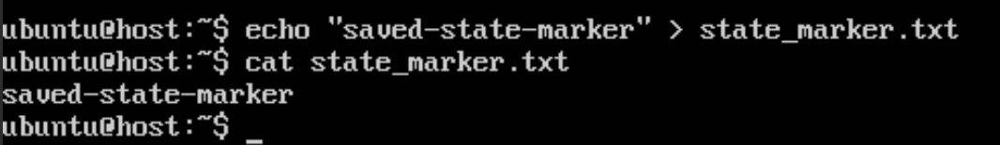
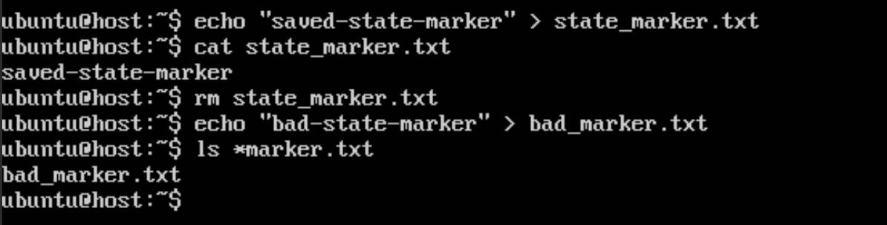
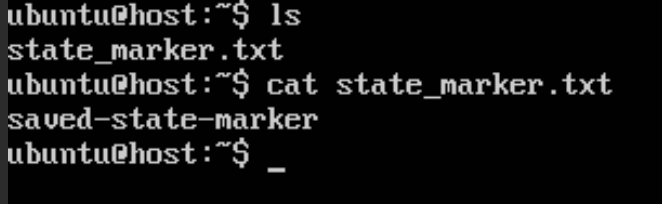

.. _save-load-tutorial:

########################################
Saving and Loading FIREWHEEL Experiments
########################################

This tutorial demonstrates how to save the state of a running FIREWHEEL experiment
and later restore it using the :ref:`helper_save` and :ref:`helper_load` Helpers.

In this tutorial, your goal is to create a known-good experiment state, make an
intentional change inside a VM, save that state, then later introduce an unwanted
change and use the save/load workflow to restore the experiment back to the
previously saved state.

This workflow is useful when you want to preserve a configured experiment for
later reuse, checkpoint an experiment before trying a risky change, recover
from a mistake made during manual VM interaction, or restore a saved experiment
in another compatible environment after appropriate validation.

By the end of this tutorial, you will have demonstrated that FIREWHEEL can restore
an experiment back to a known saved point rather than forcing you to rebuild and
reconfigure everything manually.

*************
Prerequisites
*************

Before starting, ensure that:

* FIREWHEEL is installed and functioning correctly.
* You have minimega version 3.0.1 or later installed, and it is configured to use absolute paths for backing images when creating snapshots (that is, with the ``MM_ABSSNAPSHOT=true`` configuration option). See :ref:`configuring-minimega` for more details.
* The necessary repositories and VM images for the chosen experiment are installed.
* You can access running VMs through miniweb or VNC.
* The testbed is in a clean state.

As with many FIREWHEEL tutorials, it is a good idea to begin by restarting the
environment:

.. code-block:: bash

    $ firewheel restart

****************
What You Will Do
****************

In this tutorial, you will first create and save a known-good checkpoint of a
running experiment. After saving, the current experiment is paused, which gives
you a natural point to either stop or resume and continue working from that
state.

The first diagram below shows that :ref:`helper_save` workflow.

.. graphviz::

   digraph save_workflow {
       rankdir=LR;
       labelloc="t";
       label="FIREWHEEL Save Workflow";
       fontsize=18;

       node [shape=box, style="rounded,filled", fillcolor="#EAF2F8", color="#4A6FA5", fontname="Helvetica"];
       edge [color="#4A6FA5", penwidth=1.5];

       running [label="Running\nExperiment"];
       modify [label="Make and Verify\nVM Change"];
       save [label="Save State\nfirewheel save"];
       backup [label="Backup Directory\n(and optional .tar)"];
       paused [label="Experiment Paused\nAfter Save"];
       resume [label="Manual Resume\nfirewheel vm resume --all"];
       continue [label="Continue Working\nfrom Saved Checkpoint"];

       running -> modify;
       modify -> save;
       save -> backup;
       save -> paused;
       paused -> resume;
       resume -> continue;
   }

Later in the tutorial, you will restore that saved checkpoint. By default, the
:ref:`helper_load` Helper automatically resumes the restored experiment, though you can also
request that it come back paused for inspection before manually resuming it.

The second diagram below shows that restore workflow.

.. graphviz::

   digraph load_workflow {
       rankdir=LR;
       labelloc="t";
       label="FIREWHEEL Load Workflow";
       fontsize=18;

       node [shape=box, style="rounded,filled", fillcolor="#EAF2F8", color="#4A6FA5", fontname="Helvetica"];
       edge [color="#4A6FA5", penwidth=1.5];

       backup [label="Saved Backup\nDirectory or Archive"];
       dryrun [label="Optional Validation\nfirewheel load --dry-run"];
       load [label="Restore State\nfirewheel load"];
       resumed [label="Restored Experiment\nAutomatically Resumed"];
       paused [label="Optional Paused Restore\nfirewheel load --paused"];
       resume [label="Manual Resume\nfirewheel vm resume --all"];
       verify [label="Verify Saved State\nWas Restored"];

       backup -> dryrun [style=dashed, label="optional"];
       backup -> load;
       dryrun -> load;
       load -> resumed;
       load -> paused [style=dashed, label="optional"];
       resumed -> verify;
       paused -> resume;
       resume -> verify;
   }

.. note::

   Before using :ref:`helper_save` and :ref:`helper_load`, keep the following
   operational expectations in mind:

   * :ref:`helper_save` pauses the currently running experiment when the save
     completes. To continue working in that same experiment after saving, run:

     .. code-block:: bash

         $ firewheel vm resume --all

   * :ref:`helper_load` requires that no FIREWHEEL experiment is currently
     running. In most cases, users should first reset the testbed with:

     .. code-block:: bash

         $ firewheel restart

   * A restore reuses existing files or directories automatically when their
     contents are identical to the backup. The :option:`load --force` option is
     only required when an existing restore destination differs from the backup.

   * If a restore fails after making partial changes, the recommended recovery is
     to reset the environment and try again:

     .. code-block:: bash

         $ firewheel restart hard

******************
Portability Status
******************

The table below summarizes the current validation status for common save/load
deployment transitions.

+----------------------------------------------------------+---------------------------+
| Restore path                                             | Current status            |
+==========================================================+===========================+
| single-node -> single-node                               | tested and verified       |
+----------------------------------------------------------+---------------------------+
| single-node -> cluster                                   | not yet supported         |
+----------------------------------------------------------+---------------------------+
| cluster -> single-node                                   | not yet supported         |
+----------------------------------------------------------+---------------------------+
| cluster -> cluster (same size)                           | not yet supported         |
+----------------------------------------------------------+---------------------------+
| cluster -> cluster (different sizes)                     | not yet supported         |
+----------------------------------------------------------+---------------------------+

When restoring into any environment other than the verified single-node to
single-node case, it is strongly recommended to run :option:`load --dry-run`
first and carefully validate VM behavior and VM Resource handling after the
restore completes.

************************
Launching an Experiment
************************

For this tutorial, we will use the :ref:`router-tree-tutorial` experiment because
it is small, familiar, and provides accessible Ubuntu VMs for verification.

Launch the experiment with:

.. code-block:: bash

    $ firewheel experiment tests.router_tree:3 minimega.launch

Once the experiment is running, verify that the VMs are up:

.. code-block:: bash

    $ firewheel vm mix
                                            VM Mix
    ┏━━━━━━━━━━━━━━━━━━━━━━━━━━━━━━━━━━━┳━━━━━━━━━━━━━┳━━━━━━━━━━━━━━━━━━━┳━━━━━━━┓
    ┃ VM Image                          ┃ Power State ┃ VM Resource State ┃ Count ┃
    ┡━━━━━━━━━━━━━━━━━━━━━━━━━━━━━━━━━━━╇━━━━━━━━━━━━━╇━━━━━━━━━━━━━━━━━━━╇━━━━━━━┩
    │ ubuntu-16.04.4-server-amd64.qcow2 │ RUNNING     │ configured        │ 4     │
    ├───────────────────────────────────┼─────────────┼───────────────────┼───────┤
    │ vyos-1.1.8.qc2                    │ RUNNING     │ configured        │ 8     │
    ├───────────────────────────────────┼─────────────┼───────────────────┼───────┤
    │                                   │             │ Total Scheduled   │ 12    │
    └───────────────────────────────────┴─────────────┴───────────────────┴───────┘

You should see a mixture of Ubuntu and VyOS VMs in the experiment.

**************************************
Connecting to a VM and Making a Change
**************************************

Now connect to one of the Ubuntu VMs.
For this tutorial, we will use ``host.root.net``.
You can connect using miniweb or VNC as described in :ref:`router-tree-miniweb`.
Once logged in, create a marker file that will be easy to verify later:

.. code-block:: bash

    $ echo "saved-state-marker" > state_marker.txt

Now verify that the file exists:

.. code-block:: bash

    $ cat state_marker.txt

You should see:

.. code-block:: text

    saved-state-marker

This file represents a useful change that you want to preserve.

*********************
Saving the Experiment
*********************

Now that the VM contains a known-good change, save the experiment.

For example:

.. code-block:: bash

    $ firewheel save --name router_tree_saved_state
    ────────────────────────────────────── Phase 1: Save Namespace ──────────────────────────────────────
    Waiting for namespace save to complete... (fw-node: 12/12) ━━━━━━━━━━━━━━━━━━━ 12/12 0:00:00
    ✓ Namespace saved successfully
    ✓ Final ns save host status recorded
    ────────────────────────────────── Phase 2: Collect Restore Data ───────────────────────────────────
    ✓ Saved minimega tap commands (e.g., a control network)
    ✓ Saved VM mapping
    ✓ Saved experiment time
    Copying schedule files... ━━━━━━━━━━━━━━━━━━━ 12/12 0:00:00
    ✓ Pruned and saved schedule files (12)
    ✓ Copied VM resource handler launch file
    ✓ Wrote manifest metadata
    ────────────────────────────────────────── Save Complete ───────────────────────────────────────────
    ✓ Experiment save completed successfully
      Saved Backup
      Experiment name            router_tree_saved_state
      Backup directory           /scratch/minimega/files/saved/router_tree_saved_state
      Schedule files             12
      launch_cmds.mm             Included
      ImageStore cache           Not included
      VmResourceStore cache      Not included
      Archive                    Not created
    Next step: Restore this backup later with firewheel load /scratch/minimega/files/saved/router_tree_saved_state
    or use firewheel vm resume --all to resume the current experiment.

This writes a backup directory in the minimega files store. In this example it is:

.. code-block:: text

    /scratch/minimega/files/saved/router_tree_saved_state

If you would also like a tar archive, you can instead use:

.. code-block:: bash

    $ firewheel save --name router_tree_saved_state --archive

.. note::

   The :option:`save --archive` option currently creates an uncompressed
   ``.tar`` archive. The :ref:`helper_load` Helper can restore from ``.tar``,
   ``.tar.gz``, or ``.tgz`` files.

   For large experiments, if you want a compressed archive for transfer or
   storage, it is generally better to compress the resulting tarball afterward
   using external tools. Highly parallel compression tools such as ``pigz`` are
   often a good choice for large backups.

   For example, to compress using all available CPU cores while keeping the
   original tarball:

   .. code-block:: bash

       $ firewheel save --name my_experiment --archive
       $ pigz -k -p "$(nproc)" my_experiment_backup.tar

   This produces ``my_experiment_backup.tar.gz``, which can later be restored
   with :ref:`helper_load`.

If you want to include the backing images and VM resources cache content, use:

.. code-block:: bash

    $ firewheel save --name router_tree_saved_state --complete --archive

At this point, FIREWHEEL has saved the entire experiment state.

******************************
Introducing an Unwanted Change
******************************

At this point, you have saved a known-good checkpoint of the experiment. As part
of the save process, the experiment is paused so that you can either preserve
that saved state and stop working, or intentionally continue working from the
current experiment as a new "fork" of that state. In practice, after saving,
you now have two choices:

#. Reset the testbed and later restore the saved checkpoint with :ref:`helper_load`.
#. Resume the currently running experiment and continue making additional changes.

For this tutorial, we will choose the second option so that we can intentionally
move the running experiment away from the saved state and later prove that
:ref:`helper_load` restores the earlier checkpoint. Resume the experiment with:

.. code-block:: bash

    $ firewheel vm resume --all
    Resumed VM Resource Handling for 12 VMs.

Now return to ``host.root.net`` and delete the saved marker file:

.. code-block:: bash

    $ rm -f state_marker.txt

Then create a different file indicating that the VM is now in an unwanted state:

.. code-block:: bash

    $ echo "bad-state-marker" > bad_marker.txt

Verify that the original saved marker is gone and the unwanted marker exists:

.. code-block:: bash

    $ ls *marker.txt

You should see only ``bad_marker.txt``.

At this point, the running experiment no longer matches the saved checkpoint.
This is exactly the kind of situation where save/load is useful: you made
additional changes after saving, decided you do not want to keep them, and now
want to return the experiment to the previously saved state.

*********************
Resetting the Testbed
*********************

Before using :ref:`helper_load`, the testbed must not already be running another FIREWHEEL experiment.
Reset the environment:

.. code-block:: bash

    $ firewheel restart

***********************
Loading the Saved State
***********************

Now that the testbed is cleared, we want to load our previously saved state.
First we will validate the backup before performing the actual restore.
If you saved a directory, you can provide either the full path to that directory
or just the saved experiment name. If only the name is provided,
:ref:`helper_load` will look for it in the minimega saved files directory.
For example:

.. code-block:: bash

    $ firewheel load router_tree_saved_state --dry-run
    ─────────────────────────────────── Phase 1: Read Backup Source ────────────────────────────────────
    Source: /scratch/minimega/files/saved/router_tree_saved_state
    ✓ Using existing backup directory
    ───────────────────────────────────── Phase 2: Validate Backup ─────────────────────────────────────
    Validated Backup
    Root directory             /scratch/minimega/files/saved/router_tree_saved_state
    Experiment name            router_tree_saved_state
    FIREWHEEL version          2.11.1.dev13
    Format version             1
    Created at                 2026-04-30T18:03:10.009534+00:00
    Schedule count             12
    Has launch_cmds.mm         True
    Has ImageStore cache       False
    Has VmResourceStore cache  False
    ✓ Backup validated
    ✓ No active FIREWHEEL experiment is running
    ✓ Restore destinations validated
    ───────────────────────────────────────── Dry Run Summary ──────────────────────────────────────────
    ✓ Dry run completed successfully
    Planned Restore
    Experiment                 router_tree_saved_state
    Saved VM files             /scratch/minimega/files/saved/router_tree_saved_state
    VM mapping                 /scratch/minimega/files/saved/router_tree_saved_state/vm_mapping.json
    Schedules                  /scratch/minimega/files/saved/router_tree_saved_state/schedules
    Launch VMs via             /scratch/minimega/files/saved/router_tree_saved_state/launch.mm
    Launch handlers via        /scratch/minimega/files/saved/router_tree_saved_state/launch_cmds.mm
    ImageStore cache           Not present
    VmResourceStore cache      Not present
    Experiment time            Would restore last
    ↺ Existing identical files/directories would be reused without overwrite
    ✓ No changes were made

This dry run gives you a chance to confirm that the restore is likely to work before FIREWHEEL makes any changes to the testbed.
In particular, it checks that the backup layout and manifest are valid, that the restore targets are suitable, and that the restore could proceed successfully in the current environment.
This is especially helpful when working with an older backup or when restoring into an environment where some files may already exist.

After confirming that the dry run succeeds, perform the actual restore.
If you saved a directory:

.. code-block:: bash

    $ firewheel load router_tree_saved_state
    ─────────────────────────────────── Phase 1: Read Backup Source ────────────────────────────────────
    Source: /scratch/minimega/files/saved/router_tree_saved_state
    ✓ Using existing backup directory
    ───────────────────────────────────── Phase 2: Validate Backup ─────────────────────────────────────
    Validated Backup
    Root directory             /scratch/minimega/files/saved/router_tree_saved_state
    Experiment name            router_tree_saved_state
    FIREWHEEL version          2.11.1.dev13
    Format version             1
    Created at                 2026-04-30T18:03:10.009534+00:00
    Schedule count             12
    Has launch_cmds.mm         True
    Has ImageStore cache       False
    Has VmResourceStore cache  False
    ✓ Backup validated
    ✓ No active FIREWHEEL experiment is running
    ✓ Restore destinations validated
    ────────────────────────────────────── Phase 3: Restore Data ───────────────────────────────────────
    ↺ Reused existing saved VM files
    ✓ Restored VM mapping (12 entries)
    ✓ Restored schedules (12 files)
    ─────────────────────────────────────── Phase 4: Launch VMs ────────────────────────────────────────
    ✓ Started saved VMs
    ─────────────────────────────────── Phase 5: Restore Experiment Time ───────────────────────────────
    ✓ Restored experiment time
    ─────────────────────────────── Phase 6: Launch VM Resource Handlers ───────────────────────────────
    ✓ Rebuilt VM resource handler socket paths for 12 VMs
    ✓ Started VM resource handlers (12 processes launched)
    ✓ Restored schedules and resumed VM Resource handling automatically
    ───────────────────────────────────────── Restore Complete ─────────────────────────────────────────
    ✓ Experiment restore completed successfully
    Restore Result
    Experiment                 router_tree_saved_state
    Saved VM path              /scratch/minimega/files/saved/router_tree_saved_state
    Saved VM files             Reused
    VM mapping entries         12
    Schedules                  12 copied / 0 reused
    ImageStore cache           Not present
    VmResourceStore cache      Not present
    VMs launched               Yes
    VM handlers launched       Yes (12 processes)
    Experiment time            Restored

.. note::

    When using ``firewheel load --paused``, resume the experiment manually when ready with:

    .. code-block:: bash

        $ firewheel vm resume --all

The :ref:`helper_load` Helper validates the backup, restores the saved VM files and metadata,
relaunches the experiment, restores schedules, and rebuilds VM Resource handler
socket paths if necessary.

****************************
Verifying the Restored State
****************************

Once the restored experiment is running, reconnect to ``host.root.net`` and check the marker files.
First, verify that the saved marker file has been restored:

.. code-block:: bash

    $ cat state_marker.txt

You should again see:

.. code-block:: text

    saved-state-marker

Next, verify that the later unwanted change is gone:

.. code-block:: bash

    $ ls bad_marker.txt

This file should no longer exist.
This confirms that the experiment was successfully restored to the previously saved checkpoint rather than preserving the later unwanted change.

