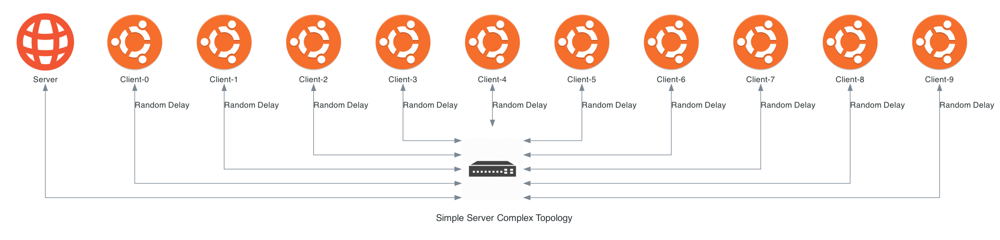
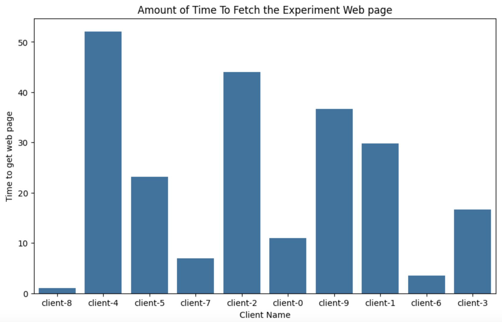

.. _adding-complexity:

*****************************
Adding Topological Complexity
*****************************

The first few parts of this tutorial created a very simple topology.
Now, we will add complexity to this experiment to demonstrate how easy it is to modify/enhance experiments.
It is important to remember that experiments should **NOT** be made more complex for the sake of "realism", rather complexity should only be added if it is required to answer the research question effectively.

In our case, we will be adding complexity using the following methods:

1. Increasing the number of clients downloading the file.
2. Adding random delay on the client edges.

After these changes, the new topology will look like:

Increasing the Number of clients
================================

First, we are going to increase the number of clients which will download the file.
There are a number of different software engineering approaches to accomplishing this goal.
We could add the following lines (changing the name and IP address) as many times as desired to the ``run()`` method:

.. code-block:: python

    # Create the client
    client = Vertex(self.g, name="Client")
    client.decorate(SimpleClient)

    # Connect the client and the switch
    client.connect(
        switch,  # The Switch Vertex
        "1.0.0.2",  # The IP address for the client
        "255.255.255.0"  # The subnet mask for the IP address network
    )

    client.grab_file(server_ip)

Alternatively, we could move the existing code into its own method, which can be called as many times as desired.
Therefore, we create a new method in ``plugin.py`` called ``create_client``.
This method should contain all the logic for creating the client and grabbing the file.
However, we will ignore the network connection for the time being.
The method should look like:

.. code-block:: python

    def create_client(self, name, server_ip):
        # Create the client
        client = Vertex(self.g, name=name)
        client.decorate(SimpleClient)
        client.grab_file(server_ip)
        return client

We will let the user decide how many clients are desired.
To do this, users pass in a value via the the CLI to the ``run()`` function.
It is important to remember that **ALL** passed in values are of type :py:class:`str`.

Let's add a parameter to the ``run()`` method called ``num_clients`` with a default value of ``"1"``.

.. code-block:: python

    def run(self, num_clients="1"):

Then, it's best practice to validate the input.

.. code-block:: python

    try:
        num_clients = int(num_clients)
    except (TypeError, ValueError):
        print("The number of clients has to be a valid integer.")
        raise

Now that we have an arbitrary number of clients, let's call our new function via a :py:obj:`for` loop.
At the bottom of the ``run()`` method (where we previously created the client) add the following:

.. code-block:: python

    for i in range(num_clients):
        client = self.create_client(f"client-{i}", server_ip)

Now that we can create our clients, we will need to connect the clients to the switch.
For this tutorial, we will just increment the IP address based on the number of client's passed in by the users.

.. warning::
    This is **NOT** a recommended approach for a production-quality model as it introduces numerous issues. For example, if there are more than 255 clients, an invalid IP address would be created and result in an odd exception being thrown. Using a proper IP address manipulation library (e.g., `netaddr <https://netaddr.readthedocs.io/en/latest/>`_) is recommended instead.

.. code-block:: python

    for i in range(num_clients):
        client = self.create_client(f"client-{i}", server_ip)
        # Connect the client and the switch
        client.connect(
            switch,  # The Switch Vertex
            f"1.0.0.{i+2}",  # The IP address for the client
            "255.255.255.0"  # The subnet mask for the IP address network
        )

Now, we can restart our experiment and pass in the newly created parameter.
When using the :ref:`helper_experiment` Helper, Plugin arguments are separated from both the Model Component name and additional arguments
by a colon (`:`). (i.e., ``<mc>:<name1>=<value1>:<name2>=<value2>`` or a combination of positional and named arguments ``<mc>:<value1>:<value2>:<named1>=<value3>``).
Note that no spaces are allowed, when passing in arguments.
See the :ref:`helper_experiment` Helper documentation for more details.

In this example, we can start the experiment with 10 clients using the command:

.. code-block:: bash

    $ firewheel experiment -r tutorials.simple_server:10 minimega.launch

Once it has started, we can confirm that we have 10 clients (using the :ref:`helper_vm_list` Helper).

.. code-block:: bash

    $ firewheel vm list

            Current VMs
    ┏━━━━━━━━━━┳━━━━━━━━━━━━━━━━━━━━━┓
    ┃ Name     ┃ State               ┃
    ┡━━━━━━━━━━╇━━━━━━━━━━━━━━━━━━━━━┩
    │ Server   │ RUNNING/configuring │
    ├──────────┼─────────────────────┤
    │ client-0 │ RUNNING/configuring │
    ├──────────┼─────────────────────┤
    │ client-1 │ RUNNING/configuring │
    ├──────────┼─────────────────────┤
    │ client-2 │ RUNNING/configuring │
    ├──────────┼─────────────────────┤
    │ client-3 │ RUNNING/configuring │
    ├──────────┼─────────────────────┤
    │ client-4 │ RUNNING/configuring │
    ├──────────┼─────────────────────┤
    │ client-5 │ RUNNING/configuring │
    ├──────────┼─────────────────────┤
    │ client-6 │ RUNNING/configuring │
    ├──────────┼─────────────────────┤
    │ client-7 │ RUNNING/configuring │
    ├──────────┼─────────────────────┤
    │ client-8 │ RUNNING/configuring │
    ├──────────┼─────────────────────┤
    │ client-9 │ RUNNING/configuring │
    └──────────┴─────────────────────┘
            Found 11 VMs

Now that the number of clients is parameterized, the experiment can be run numerous times varying the number of clients.

Adding Edge Delay
=================

Now that we have numerous clients all trying to download the file.
We will add some delay to the client connections.
FIREWHEEL/minimega has the ability to add various QoS parameters to edges as documented in the :py:class:`QoSEdge <base_objects.QoSEdge>` class and the :ref:`tests.qos_mc` Model Component.
For our experiment, we will add random delay for each client.
First, we need to import ``random`` into our ``plugin.py``.

.. code-block:: python
    :emphasize-lines: 1

    import random
    from firewheel.control.experiment_graph import AbstractPlugin, Vertex

    from base_objects import Switch
    from tutorials.simple_server import SimpleServer, SimpleClient

Then we can use the :py:func:`random.randint` function to help generate a random integer.
In our case, we want a number between 1 and 100 which can represent the amount of delay in milliseconds.
Then, we can add it to the edge connecting the client and switch.
The new client generation :py:obj:`for` loop should look like:

.. code-block:: python
    :emphasize-lines: 4,10

    for i in range(num_clients):
        client = self.create_client(f"client-{i}", server_ip)

        delay = random.randint(1,100)
        # Connect the client and the switch
        client.connect(
            switch,  # The Switch Vertex
            f"1.0.0.{i+2}",  # The IP address for the client
            "255.255.255.0",  # The subnet mask for the IP address network
            delay=f"{delay}ms",
        )

.. note::
    For more complex topologies, we recommend using the `netaddr <https://netaddr.readthedocs.io/en/latest/>`_ module for creating/assigning IP addresses to VMs. This is discussed further in the :ref:`acme-tutorial`.

Checking Final Results
======================

At this point, you can restart the experiment and view the output in the VM Resource logs to verify that the delay has correctly been implemented.

To restart our experiment with the new changes, we can run the following command::

    $ firewheel experiment -r tutorials.simple_server:10 minimega.launch

Now, we will wait until the experiment has completed.
Recall that we can use the :ref:`helper_vm_mix` helper to view the status of the various VMs.
Additionally, we can use the :ref:`helper_vm_list` helper to see additional information.
In the following command, we will view the ``state`` of the VMs as well as the scheduled negative time (if any):

.. code-block:: bash

    $ firewheel vm list state time

                Current VMs
    ┏━━━━━━━━━━┳━━━━━━━━━━━━━━━━━━━━┳━━━━━━┓
    ┃ Name     ┃ State              ┃ Time ┃
    ┡━━━━━━━━━━╇━━━━━━━━━━━━━━━━━━━━╇━━━━━━┩
    │ Server   │ RUNNING/configured │  :)  │
    ├──────────┼────────────────────┼──────┤
    │ client-0 │ RUNNING/configured │  :)  │
    ├──────────┼────────────────────┼──────┤
    │ client-1 │ RUNNING/configured │  :)  │
    ├──────────┼────────────────────┼──────┤
    │ client-2 │ RUNNING/configured │  :)  │
    ├──────────┼────────────────────┼──────┤
    │ client-3 │ RUNNING/configured │  :)  │
    ├──────────┼────────────────────┼──────┤
    │ client-4 │ RUNNING/configured │  :)  │
    ├──────────┼────────────────────┼──────┤
    │ client-5 │ RUNNING/configured │  :)  │
    ├──────────┼────────────────────┼──────┤
    │ client-6 │ RUNNING/configured │  :)  │
    ├──────────┼────────────────────┼──────┤
    │ client-7 │ RUNNING/configured │  :)  │
    ├──────────┼────────────────────┼──────┤
    │ client-8 │ RUNNING/configured │  :)  │
    ├──────────┼────────────────────┼──────┤
    │ client-9 │ RUNNING/configured │  :)  │
    └──────────┴────────────────────┴──────┘
                Found 11 VMs

In the example above, the experiment has finished configuring, so no negative time has been displayed.
Now, viewing our VM Resource logs, we can verify that the experiment has finished (by identifying that the clients have completed using cURL to grab the file).

Once again, we will ingest our logs into Jupyter by updating the ``paths`` variable in our notebook.

.. code-block:: ipython

    # Now we should get all the client data
    paths = vm_resource_log_path.glob("client-*.json")

The results will look similar to the following:

Now, you are ready to create more experiments and analyze the data!

Final Plugin
============

The resulting changes from above should have resulted in a plugin which looks like:

.. code-block:: python

    import random

    from base_objects import Switch
    from tutorials.simple_server import SimpleClient, SimpleServer

    from firewheel.control.experiment_graph import Vertex, AbstractPlugin

    class Plugin(AbstractPlugin):
        """tutorials.simple_server plugin documentation.

        This Plugin creates a basic topology with a Server and several clients.
        The clients all have a random delay on their outbound connection.
        """

        def run(self, num_clients="1"):
            """Run method documentation.

            This method contains the primary logic for the Plugin.

            Arguments:
                num_clients (str): The number of clients in the topology. This should be
                    convertible to an integer.
            """
            try:
                # Convert the number of clients to an integer
                num_clients = int(num_clients)
            except (TypeError, ValueError):
                print("The number of clients has to be a valid integer.")
                raise

            # Create the Server
            server = Vertex(self.g, name="Server")
            server.decorate(SimpleServer)

            # Create the switch
            switch = Vertex(self.g, name="Switch")
            switch.decorate(Switch)

            # Connect the server and the switch
            server_ip = "1.0.0.1"
            server.connect(
                switch,  # The Switch Vertex
                server_ip,  # The IP address for the server
                "255.255.255.0",  # The subnet mask for the IP address network
            )

            # Create all of our clients
            for i in range(num_clients):
                client = self.create_client(f"client-{i}", server_ip)

                delay = random.randint(1, 100)
                # Connect the client and the switch
                client.connect(
                    switch,  # The Switch Vertex
                    f"1.0.0.{i+2}",  # The IP address for the client
                    "255.255.255.0",  # The subnet mask for the IP address network
                    delay=f"{delay}ms",
                )

        def create_client(self, name, server_ip):
            """Create a single client.

            Arguments:
                name (str): The name of the vertex.
                server_ip (str): The IP Address of the Server.

            Returns:
                tutorials.simple_server.SimpleClient: The newly created client.
            """
            client = Vertex(self.g, name=name)
            client.decorate(SimpleClient)
            client.grab_file(server_ip)
            return client
