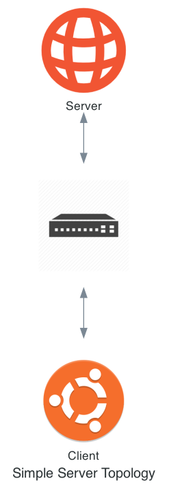

.. _simple-server-initial-topology:

***********************************
Creating the Simple Server Topology
***********************************

Recall that the network will look like:

The actual code that builds the topology is the Simple Server Model Component's ``plugin`` which we specified as ``plugin.py`` in the ``MANIFEST`` file.
Therefore, open the file ``/opt/firewheel/model_components/simple_server/plugin.py`` to get started.

.. _simple-server-abstract_plugin:

Opening Our Plugin
==================

Within every plugin file, FIREWHEEL automatically looks for a plugin class to define the plugin's execution.
This class must meet two criteria.

First, the class that gets declared must inherit from :py:class:`AbstractPlugin <firewheel.control.experiment_graph.AbstractPlugin>`.
This guarantees that the :ref:`experiment-graph` instance is properly handled and located in the variable ``self.g``.
Additionally, this inheritance also provides a logger in ``self.log`` to each plugin to facilitate easy debugging.

Second, the plugin must have a ``run`` method.
This is the method that gets invoked by FIREWHEEL to kick off the plugin.
The ``run`` method can also take parameters, if needed, for the topology.

As a note, only one such plugin class may be defined per plugin file (more would be ambiguous and therefore will cause FIREWHEEL to raise an error).

With this context in mind, we will be editing the ``run`` method first.

Open the file ``/opt/firewheel/model_components/simple_server/plugin.py`` to get started.

It should look something like this:

 .. code-block:: python

    from firewheel.control.experiment_graph import AbstractPlugin, Vertex

    class Plugin(AbstractPlugin):
        """tutorials.simple_server plugin documentation."""

        def run(self):
            """Run method documentation."""
            # TODO: Implement plugin actions here
            pass

.. _simple-server-run:

Implementing the Plugin
=======================

We will start by just creating the topology and then adding the necessary VM resources to provide the web server and client with the necessary functionality.

Set up
------
Before working on any particular part of the topology, we should first add a few necessary import statements.
Add the following to the top of ``plugin.py``.

.. code-block:: python

    from base_objects import Switch
    from linux.ubuntu1604 import Ubuntu1604Server

These imports provide the necessary graph objects needed to create the topology.

Adding the Basic Topology
-------------------------

We create a vertex by instantiating a :py:class:`Vertex <firewheel.control.experiment_graph.Vertex>` object and passing it the graph (``self.g``) as well as the name of the vertex.
The ``plugin.py`` template has already imported :py:class:`Vertex <firewheel.control.experiment_graph.Vertex>` for you from :py:mod:`firewheel.control.experiment_graph`.
Once we have created a :py:class:`Vertex <firewheel.control.experiment_graph.Vertex>`, we can decorate it as a specific object type.
In this case, we want the server to be a Ubuntu 16.04 server.
We have imported the the :py:class:`Ubuntu1604Server <linux.ubuntu1604.Ubuntu1604Server>` object already (from the :ref:`linux.ubuntu1604_mc` MC) so we can use it to decorate our server.

.. code-block:: python

    def run(self):
        """Run method documentation."""
        # Create the Server
        server = Vertex(self.g, name="Server")
        server.decorate(Ubuntu1604Server)

In FIREWHEEL :py:class:`Switches <base_objects.Switch>` are essentially virtual network bridges which help connect two VMs.
Users *can* make a Switch into a VM if some specific switching technique is being evaluated, but typically, they will just be instantiated as an Open vSwitch bridge.
A :py:class:`Switch <base_objects.Switch>` is created in a way that is very similar to the routers.
The only difference is that we decorate the :py:class:`Vertex <firewheel.control.experiment_graph.Vertex>` with :py:class:`Switch <base_objects.Switch>`.
:py:class:`Switches <base_objects.Switch>` can be imported from :ref:`base_objects_mc`.

We can now create our switch.

.. code-block:: python

    def run(self):
        """Run method documentation."""
        # Create the Server
        server = Vertex(self.g, name="Server")
        server.decorate(Ubuntu1604Server)

        # Create the switch
        switch = Vertex(self.g, name="Switch")
        switch.decorate(Switch)

Now that we have the :py:class:`Switch <base_objects.Switch>` and the server, we can connect them together.
Initially, we will use a hard-coded IP address.

.. note::
    For more complex topologies, we recommend using :py:mod:`netaddr` to generate IP address. As we add more clients later in this tutorial, we will switch to using it.

.. note::
    While we use IPv4 addresses for this tutorial, FIREWHEEL is also capable of using IPv6 addresses.

.. code-block:: python

    def run(self):
        """Run method documentation."""
        # Create the Server
        server = Vertex(self.g, name="Server")
        server.decorate(Ubuntu1604Server)

        # Create the switch
        switch = Vertex(self.g, name="Switch")
        switch.decorate(Switch)

        # Connect the server and the switch
        server.connect(
            switch,  # The Switch Vertex
            "1.0.0.1",  # The IP address for the server
            "255.255.255.0"  # The subnet mask for the IP address network
        )

We then do the same thing to create the client and connect it to the switch.

.. code-block:: python

    # Create the client
    client = Vertex(self.g, name="Client")
    client.decorate(Ubuntu1604Server)

    # Connect the client and the switch
    client.connect(
        switch,  # The Switch Vertex
        "1.0.0.2",  # The IP address for the client
        "255.255.255.0"  # The subnet mask for the IP address network
    )

Completed Initial Topology
--------------------------
The full ``plugin.py`` now looks like:

.. code-block:: python

    from firewheel.control.experiment_graph import AbstractPlugin, Vertex

    from base_objects import Switch
    from linux.ubuntu1604 import Ubuntu1604Server

    class Plugin(AbstractPlugin):
        """tutorials.simple_server plugin documentation."""

        def run(self):
            """Run method documentation."""
            # Create the Server
            server = Vertex(self.g, name="Server")
            server.decorate(Ubuntu1604Server)

            # Create the switch
            switch = Vertex(self.g, name="Switch")
            switch.decorate(Switch)

            # Connect the server and the switch
            server.connect(
                switch,  # The Switch Vertex
                "1.0.0.1",  # The IP address for the server
                "255.255.255.0"  # The subnet mask for the IP address network
            )

            # Create the client
            client = Vertex(self.g, name="Client")
            client.decorate(Ubuntu1604Server)

            # Connect the client and the switch
            client.connect(
                switch,  # The Switch Vertex
                "1.0.0.2",  # The IP address for the client
                "255.255.255.0"  # The subnet mask for the IP address network
            )
