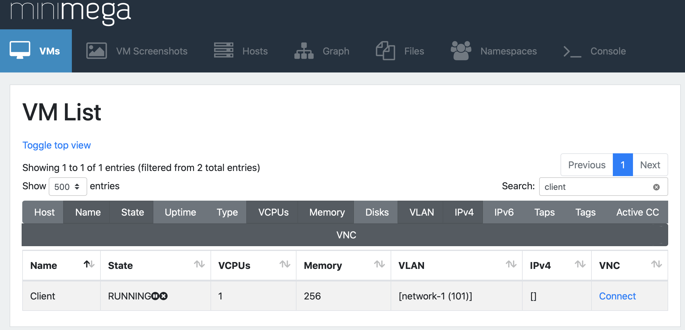
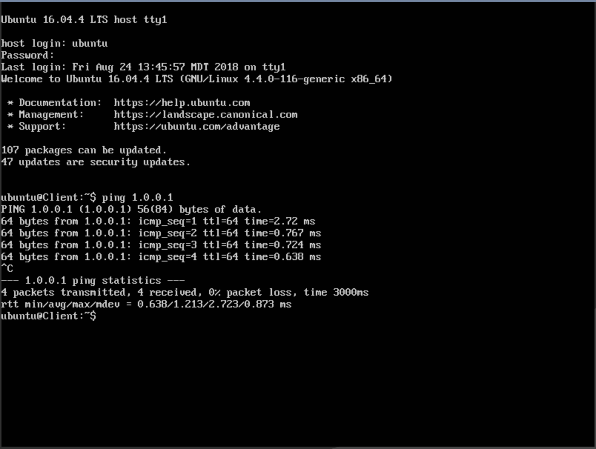

.. _running-simple-server-topo:

********************
Testing the Topology
********************

Now that we have created our ``tutorials.simple_server`` MC, we can test it to see it if works as expected.
First, we can try executing it without launching any VMs.
This helps us find any syntax errors or issues with the ``MANIFEST`` file.

To do so, we can run::

    $ firewheel experiment tutorials.simple_server

You should see the following output:

.. code-block:: bash

    $ firewheel experiment tutorials.simple_server

                Model Components Executed
    ┏━━━━━━━━━━━━━━━━━━━━━━━━━┳━━━━━━━━━━━━┳━━━━━━━━━━━━━━━┓
    ┃  Model Component Name   ┃   Result   ┃    Timing     ┃
    ┡━━━━━━━━━━━━━━━━━━━━━━━━━╇━━━━━━━━━━━━╇━━━━━━━━━━━━━━━┩
    │ base_objects            │         OK │ 0.011 seconds │
    │ linux.base_objects      │         OK │ 0.020 seconds │
    │ linux.ubuntu            │         OK │ 0.024 seconds │
    │ linux.ubuntu1604        │         OK │ 0.014 seconds │
    │ misc.blank_graph        │         OK │ 0.002 seconds │
    │ tutorials.simple_server │         OK │ 0.640 seconds │
    ├─────────────────────────┼────────────┼───────────────┤
    │                         │ Total Time │ 1.246 seconds │
    └─────────────────────────┴────────────┴───────────────┘
            Dependency resolution took 0.405 seconds

.. note::
    If this is the first time you are running an experiment, you may see output which indicates that various image files are being cached: e.g., ``Adding images/ubuntu-16.04.4-server-amd64.qcow2.xz to cache. This may take a while.``. The images are being decompressed and cached for quicker access in future experiments.

If any errors are found, fix them before moving on to the next step.

Launching the Topology
======================
Now we are ready to launch the topology.
We can instantiate it with `minimega <https://www.sandia.gov/minimega/>`__ by using the :ref:`minimega.launch_mc` MC::

    $ firewheel experiment -r tutorials.simple_server minimega.launch

.. note::
    The ``-r`` flag (i.e., ``--restart``) will clear any currently running experiments and ensure the testbed is clear before launching the current experiment. See the :ref:`helper_experiment` CLI command documentation for details.

You should see the following output:

.. code-block:: bash

    $ firewheel experiment -r tutorials.simple_server minimega.launch

                            Model Components Executed
    ┏━━━━━━━━━━━━━━━━━━━━━━━━━━━━━━━━━┳━━━━━━━━━━━━┳━━━━━━━━━━━━━━━━┓
    ┃      Model Component Name       ┃   Result   ┃     Timing     ┃
    ┡━━━━━━━━━━━━━━━━━━━━━━━━━━━━━━━━━╇━━━━━━━━━━━━╇━━━━━━━━━━━━━━━━┩
    │ misc.blank_graph                │         OK │  0.002 seconds │
    │ base_objects                    │         OK │  0.013 seconds │
    │ linux.base_objects              │         OK │  0.721 seconds │
    │ linux.ubuntu                    │         OK │  0.022 seconds │
    │ linux.ubuntu1604                │         OK │  0.017 seconds │
    │ tutorials.simple_server         │         OK │  0.651 seconds │
    │ minimega.emulated_entities      │         OK │  0.006 seconds │
    │ minimega.testbed_available      │         OK │  0.028 seconds │
    │ generic_vm_objects              │         OK │  0.001 seconds │
    │ vyos                            │         OK │  0.018 seconds │
    │ vyos.helium118                  │         OK │  0.017 seconds │
    │ minimega.create_mac_addresses   │         OK │  0.003 seconds │
    │ minimega.resolve_vm_images      │         OK │  0.018 seconds │
    │ minimega.configure_ips          │         OK │  0.002 seconds │
    │ minimega.send_miniweb_arp       │         OK │  0.001 seconds │
    │ minimega.schedules_ready        │         OK │  0.000 seconds │
    │ vm_resource.schedule            │         OK │  0.028 seconds │
    │ vm_resource.validate            │         OK │  0.016 seconds │
    │ minimega.parse_experiment_graph │         OK │  1.046 seconds │
    │ minimega.launch                 │         OK │  0.000 seconds │
    ├─────────────────────────────────┼────────────┼────────────────┤
    │                                 │ Total Time │ 24.006 seconds │
    └─────────────────────────────────┴────────────┴────────────────┘
                Dependency resolution took 1.915 seconds

Once the topology is up and running you can use the :ref:`helper_vm_mix` command to check the state of the environment:

.. code-block:: bash

    $ firewheel vm mix
                                        VM Mix
    ┏━━━━━━━━━━━━━━━━━━━━━━━━━━━━━━━━━━━┳━━━━━━━━━━━━━┳━━━━━━━━━━━━━━━━━━━┳━━━━━━━┓
    ┃ VM Image                          ┃ Power State ┃ VM Resource State ┃ Count ┃
    ┡━━━━━━━━━━━━━━━━━━━━━━━━━━━━━━━━━━━╇━━━━━━━━━━━━━╇━━━━━━━━━━━━━━━━━━━╇━━━━━━━┩
    │ ubuntu-16.04.4-server-amd64.qcow2 │ RUNNING     │ configured        │ 2     │
    ├───────────────────────────────────┼─────────────┼───────────────────┼───────┤
    │                                   │             │ Total Scheduled   │ 2     │
    └───────────────────────────────────┴─────────────┴───────────────────┴───────┘

Checking Connectivity
=====================
Once all of the nodes have been ``configured`` we can verify that the graph is connected as expected.
For this tutorial, we will use `miniweb <https://www.sandia.gov/minimega/module-10-web-interface-and-connecting-to-a-virtual-machine-with-vnc/>`__ to connect to the VMs.
Please see :ref:`router-tree-miniweb` for details on connecting to miniweb.

Once you are connected to miniweb, you can log into several of the VMs and verify connectivity manually via ping.

.. note ::
    We recommend that your VMs use simple default user names/passwords for ease of use.
    For example, VMs that are ``Ubuntu`` based have a default username of ``ubuntu`` and a default password of ``ubuntu``.

For our experiment we should verify that the client can ping the server.
In miniweb, you can search for ``client`` and then click the ``connect`` button to join the VNC session.

We know that the IP address for the server is ``1.0.0.1``.
So we can log into the VM and `ping <https://en.wikipedia.org/wiki/Ping_(networking_utility)>`_ this IP address to verify connectivity.

Now that we verified that the topology is working as expected!
