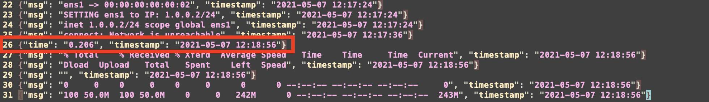
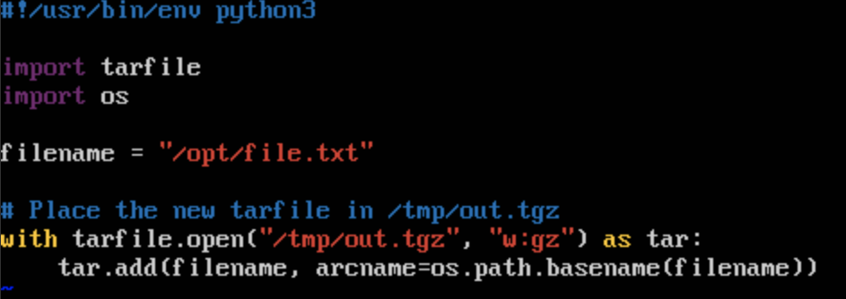

.. _simple-server-vmr-debugging:

**********************
Debugging VM Resources
**********************
The previous module added new VM resources to the experiment but it is equally important to understand how to debug these VM resources if there are issues.
This module will discuss where VM resources are located in experiments, how to search for errors, and methods for quickly debugging malfunctioning VM resources.

Locating Data Output
====================

As described in :ref:`vmr-output`, when a VMR prints to ``stdout``, that output will be captured by FIREWHEEL and logged to the folder specified by the :ref:`logging.vmr_log_dir <config-vmr_log_dir>` configuration parameter on the :ref:`compute node <cluster-compute-nodes>` which has launched the VM.

Therefore, now that we have started our experiment, we can view that output.
By default, the :ref:`logging.vmr_log_dir <config-vmr_log_dir>` is ``/tmp/firewheel/vm_resource_logs``.
However, it is also common to use ``/scratch/vm_resource_logs`` as well.
For this tutorial, we will assume it's located at ``/scratch/vm_resource_logs``.

If you look in this directory after your experiment has started, you will see 4 files:

.. code-block:: bash

    $ ls /scratch/vm_resource_logs
    Client.json  Client.log  Server.json  Server.log

There will be a log file for each VM and a JSON file, containing some of the same messages, formatted in JSON (for easy data analysis).
Inside the ``Client.log`` file, you will see all the interactions between FIREWHEEL and the VM.
This includes the VM starting up (represented by messages indicating that ``QEMU Guest Agent not alive yet``), writing various VM resources to the the VM (``Creating directory: /var/launch/-250/set_hostname.sh``), setting the IP addresses, and our own cURL output (at the bottom of the log).

Similarly, opening the ``Client.json`` will have more terse output, but formatted in JSON.
Towards the end of this file, we should see our own output:

This log data will be used in the next module for data analysis.

Breaking VMRs
=============

Assuming that the entire experiment to this point was coded with perfection, let's introduce an intentional bug.
Prior to doing this, we recommend making a copy of your existing ``model_component_objects.py`` file into your home directory so that it is easy to revert our changes.

.. code-block:: bash

    $ cp model_component_objects.py ~/simple_server_model_component_objects.py

Now, let's try adding a new, purposely broken VM resource to the ``SimpleServer`` object.
In this module, we will compress our file to transfer and purposely fail to decompress it correctly.
We will use two methods for doing this:

1. A new python VMR to compress the file (after it is dropped).
2. A new bash program to decompress the file prior to the experiment starting.

New VMRs
--------

Python has the build-in :py:mod:`tarfile` which is useful for compressing and decompressing files.
We will leverage this library to compress our file.
First, create a new file called ``compress.py`` in the ``vm_resources`` directory and add the following:

.. code-block:: python
    :caption: ``vm_resources/compress.py``
    :linenos:

    #!/usr/bin/env python3
    import tarfile

    filename = "/opt/file.txt"

    # Place the new tarfile in /tmp/out.tgz
    with tarfile.open("/tmp/out.tgz", "w:gz") as tar:
        tar.add(filename, arcname=os.path.basename(filename))

.. note::
    The `shebang <https://en.wikipedia.org/wiki/Shebang_(Unix)>`_ line (i.e., ``#!/usr/bin/env python3``) is necessary because we provide the VMR as the executable program to use with :py:meth:`run_executable <base_objects.VMEndpoint.run_executable>`. Without this line, the Python script would be interpreted as a shell script.

Importantly, there is a bug in this program.
At line 7, we use the :py:mod:`os` library without importing it, which will cause the program to fail.
For now, we will ignore this error and continue to try and decompress the file with a shell script.

The shell script to decompress this file is rather simple:

.. code-block:: bash

    $ # Place the output in /tmp
    $ tar -C /tmp -xvzf /tmp/out.tgz

Now that we know what our VMRs are, we can modify ``model_component_objects.py`` to execute them.
We know that the file gets created at ``time=-5`` so these should each occur after that.
We will run the Python VMR at ``time=-4`` and the shell script at ``time=-3``.
Finally, we will verify our file exists by printing out the first few lines of the file at ``time=-2``.
Recall that this will fail!

Add the following to ``model_component_objects.py``:

.. code-block:: python
    :linenos:
    :lineno-start: 8
    :emphasize-lines: 15-20

    @require_class(Ubuntu1604Server)
    class SimpleServer:
        """SimpleServer Class documentation."""

        def __init__(self):
            self.configure_files_to_serve()

            # Start the web server at time=1
            # The server needs to run in the ``/opt`` directory because that is where the
            # file will be located.
            self.run_executable(
                1, "bash", arguments="-c 'pushd /opt; python3 -m http.server; popd'"
            )

            # Adding our compress/decompress VMRs
            self.run_executable(-4, "compress.py", vm_resource=True)
            self.run_executable(-3, "tar", arguments="-C /tmp -xvzf /tmp/out.tgz")

            # Print the first few lines of the file
            self.run_executable(-2, "head", arguments="/tmp/file.txt")

Viewing the Results
-------------------
Let's restart the experiment and see what happens.

.. note::

    The logging verbosity for the :ref:`vm-resource-handler` on the ``DEBUG`` level is significant and we recommend changing it at least to ``INFO``. This can be accomplished by running:

    .. code-block:: bash

        $ firewheel config set -s logging.level INFO

.. code-block:: bash

    $ firewheel experiment -r tutorials.simple_server minimega.launch

Once the experiment has configured, let's investigate the VM resource logs for the Server.
Recall that this module will assume they are located at ``/scratch/vm_resource_logs``.
A truncated section of output is shown below:

.. code-block:: text
    :emphasize-lines: 3,4,9,10

    [2024-06-06 00:43:06 GMT INFO] CALL ARGS: /var/launch/-4/compress.py/call_arguments.sh
    [2024-06-06 00:43:06 GMT INFO] PID returned: 1281
    [2024-06-06 00:43:08 GMT WARNING] compress.py (1281) exited after 2.074975 seconds with code: 1
    [2024-06-06 00:43:08 GMT INFO] b'Traceback (most recent call last):\n  File "/var/launch/-4/compress.py/compress.py", line 9, in <module>\n    tar.add(filename, arcname=os.path.basename(filename))\nNameError: name \'os\' is not defined\n'
    [2024-06-06 00:43:12 GMT INFO] CALL ARGS: /var/launch/-3/tar/call_arguments.sh
    [2024-06-06 00:43:12 GMT INFO] PID returned: 1285
    [2024-06-06 00:43:16 GMT INFO] CALL ARGS: /var/launch/-2/head/call_arguments.sh
    [2024-06-06 00:43:16 GMT INFO] PID returned: 1290
    [2024-06-06 00:43:18 GMT WARNING] head (1290) exited after 2.074531 seconds with code: 1
    [2024-06-06 00:43:18 GMT INFO] b"head: cannot open '/tmp/file.txt' for reading: No such file or directory\n"

While is is not overtly obvious via :ref:`helper_vm_mix` that there was an error, the logs indicate that a non-zero exit code was generated from our new VM resources as well as specific error messages.

.. note::

    The design decision to not indicate the failure of VM resources via non-zero exit codes within the VM resource status is intentional. While zero exit codes are the typical convention, they don't always indicate errors. Furthermore, some non-zero exit codes could be expected for certain experiments. For these reasons, it is left to the user to understand the expected behavior of the VMRs used within their experiment.

In-Experiment Debugging
=======================
In our contrived example, it is easy to identify the error.
However, that may not always be the case.
This section will demonstrate how to debug and test VMRs within an experiment without restarting the experiment each time.
Note that, in some cases, experiment restart may be the only way to test VMR bug fixes, but the added time delay makes this a secondary option.

For each VM, FIREWHEEL creates a custom directory for all the VM resources.
On Linux-based systems, the path is ``/var/launch``.

.. seealso::
    :ref:`vmr-location`

Open miniweb and log into the Server.
Change into the directory containing ``compress.py``.
In this case it would be:

.. code-block:: bash

    $ cd /var/launch/-4/compress.py/

.. note::
    The full name of the VM resource (in this case ``compress.py``) is a *directory* which contains the actual file (as well as other data).

.. image:: images/simple_server_vmr_compress.png
   :alt: Viewing the ``/var/launch/-4/compress.py/`` directory

Now we can edit ``compress.py`` **within** the experiment and add the missing :py:data:`import` statement.

Now that we have fixed ``compress.py``, we can try re-running it just as FIREWHEEL would.
FIREWHEEL executes VM resources as the root user by executing the ``call_arguments.sh`` script within each VMR directory.
In our example, it would look like:

.. image:: images/simple_server_vmr_tested.png
   :alt: Running the fixed ``compress.py``

We have now verified that there are no more execution errors and that the script worked as intended (by viewing the file in ``/tmp/out.tgz``).
While we have fixed the script *within* the experiment, it has not been fixed for the *next* experiment.
In some cases it may be trivial to simply add the changes to the underlying VMR.
However, in others, it may make more sense to simply copy the file out of the experiment with the :ref:`helper_pull_file` Helper.
This Helper and other methods for extracting files will be discussed in the next module (:ref:`manual-interaction`).

On your FIREWHEEL node, run the following command:

.. code-block:: bash

    $ firewheel pull file /var/launch/-4/compress.py/compress.py Server /opt/firewheel/model_components/simple_server/vm_resources/compress.py
    Checking if the file is ready... - 0:00:06
    compress.py           100%  226   765.5KB/s   00:00

Now we should now see that our own file has been replaced with the working version.

Final Steps
===========
Now that we have our VMR working properly, we can re-run the experiment and verify it is working as expected.

.. code-block:: bash

    $ firewheel experiment -r tutorials.simple_server minimega.launch

After the experiment has been configured, we can revisit the ``Server`` VM resource logs and see output similar to:

.. code-block:: text
    :emphasize-lines: 5

    [2024-06-06 12:05:14 GMT INFO] CALL ARGS: /var/launch/-4/compress.py/call_arguments.sh
    [2024-06-06 12:05:14 GMT INFO] PID returned: 1261
    [2024-06-06 12:05:20 GMT INFO] CALL ARGS: /var/launch/-3/tar/call_arguments.sh
    [2024-06-06 12:05:20 GMT INFO] PID returned: 1265
    [2024-06-06 12:05:22 GMT INFO] b'file.txt\n'
    [2024-06-06 12:05:25 GMT INFO] CALL ARGS: /var/launch/-2/head/call_arguments.sh
    [2024-06-06 12:05:25 GMT INFO] PID returned: 1270
    [2024-06-06 12:05:27 GMT ERROR] 'utf-8' codec can't decode byte 0xef in position 0: invalid continuation byte
    Traceback (most recent call last):
    File "/opt/firewheel/src/firewheel/vm_resource_manager/vm_resource_handler.py", line 441, in run_vm_resource
        self._run_vm_resource(schedule_entry, queue)
    File "/opt/firewheel/src/firewheel/vm_resource_manager/vm_resource_handler.py", line 532, in _run_vm_resource
        exitcode = self.driver.get_exitcode(pid)
    File "/opt/firewheel/src/firewheel/vm_resource_manager/abstract_driver.py", line 324, in get_exitcode
        cache = self.exec_status(pid)
    File "/opt/firewheel/src/firewheel/vm_resource_manager/drivers/qemu_guest_agent_driver.py", line 532, in exec_status
        self.store_captured_output(pid, result)
    File "/opt/firewheel/src/firewheel/vm_resource_manager/drivers/qemu_guest_agent_driver.py", line 565, in store_captured_output
        cache["stdout"] += str(
    UnicodeDecodeError: 'utf-8' codec can't decode byte 0xef in position 0: invalid continuation byte

In our output, we can see that the errors from ``compress.py`` and ``tar`` have been eliminated and that the ``tar`` command has returned the correct output (i.e., ``file.txt``).
However, in this case we found a new error with printing our data to the :ref:`vm-resource-handler`.
As we can see, FIREWHEEL can only log valid UTF-8 encoded data but our file was created with random bytes via :py:func:`os.urandom`, which will not print correctly.
In this case, we can ignore the error as it does not impact the experiment and we have validated that our VMR's are working correctly.

Now we can revert our changes and proceed to the next module to analyze our data.

.. code-block:: bash

    $ cp ~/simple_server_model_component_objects.py model_component_objects.py

.. note::

    We do not have to remove the ``compress.py`` file as it will no longer be executed within the experiment.
