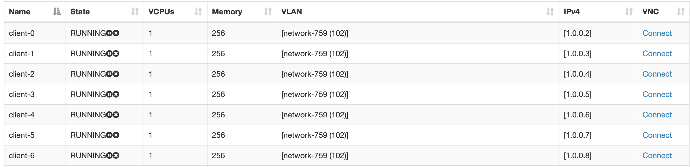
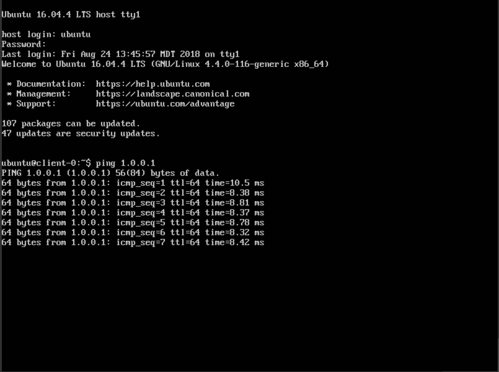
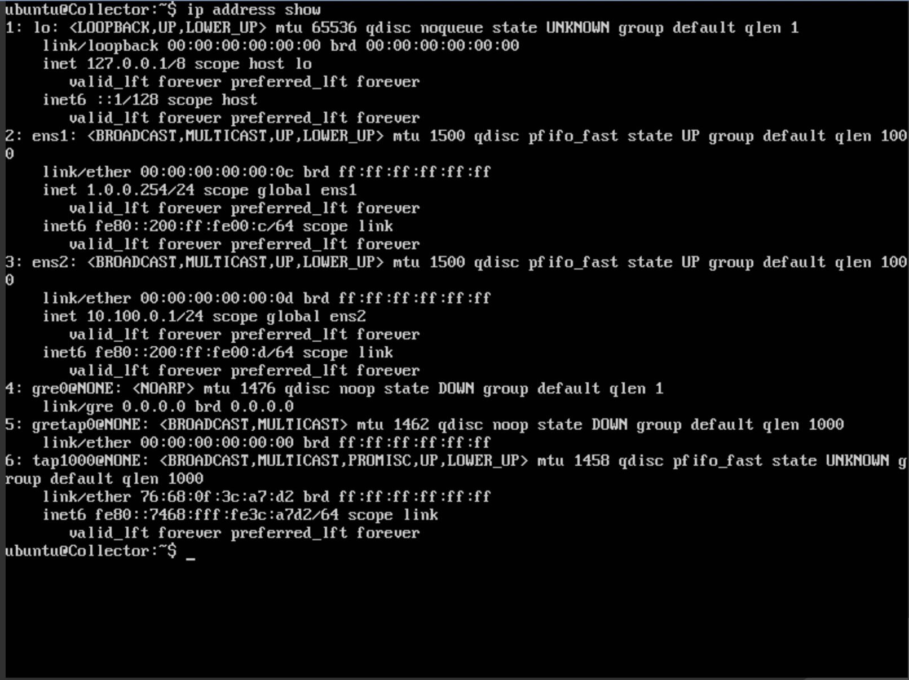
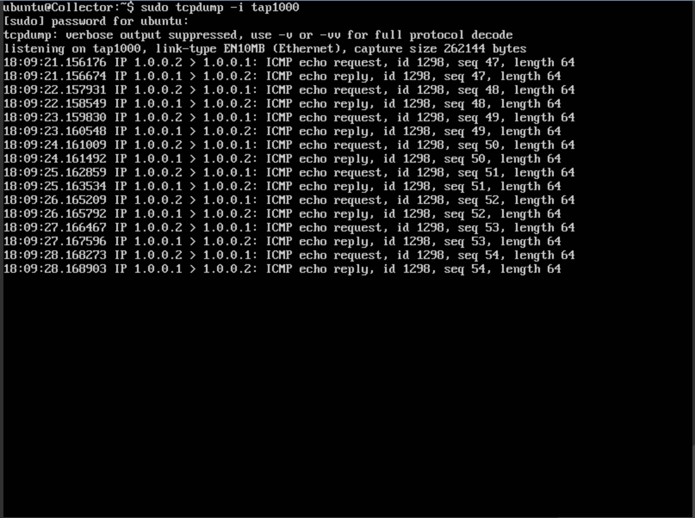

.. _tap-tutorial:

###################################
Tapping a Link Within an Experiment
###################################

In this tutorial we will demonstrate how to effectively use the :ref:`layer2.tap_mc` Model Component to mirror traffic from one VM to another VM within an experiment.
This could be useful in experiments where in-experiment traffic needs to be processed by some collector/analysis platform, such as `Zeek <https://zeek.org>`__, `Splunk <https://www.splunk.com>`__, or `Elastic Stack <https://www.elastic.co>`__.
For our purposes, we will build off of the topology built in the :ref:`simple-server-tutorial` (the completed topology can be cloned from FIREWHEEL's git repository).

If you haven't already cloned the :ref:`tutorials.simple_server_mc` Model Component into FIREWHEEL, do the following::

    $ cd /opt/firewheel/model_components
    $ git clone ssh://<git server hostname>:firewheel/model_components/tutorials/simple-server.git

**********************
Updating Simple Server
**********************

The simple server tutorial will be updated here to use the :ref:`layer2.tap_mc` MC *after* the topology has been created.
This Model Component walks the graph looking for :py:class:`Edges <firewheel.control.experiment_graph.Edge>` that have the ``tap`` attribute set.
Specifically, the ``tap`` attribute on the :py:class:`Edge <firewheel.control.experiment_graph.Edge>` must specify a list of collectors that will receive the mirrored traffic.
The list of of collectors can contain either the actual :py:class:`Vertex <firewheel.control.experiment_graph.Vertex>` object (recommended) or the name of the collector :py:class:`Vertex <firewheel.control.experiment_graph.Vertex>`.
Generally, this "collector" of the mirrored traffic will be some sort of analysis platform such as `Zeek <https://zeek.org>`__ or `Splunk <https://www.splunk.com>`__, but for our purposes here we'll just use a :py:class:`Ubuntu1604Server <linux.ubuntu1604.Ubuntu1604Server>`.

Tap a Link in the Topology
==========================
First, we need to choose a link to tap in the topology.
Let's assume that the traffic to the Server needs to be monitored.
Then the topology would look like:

.. image:: simple_server/images/simple_server_tap_topology.png
   :alt: Tapped Topology

Open the :ref:`tutorials.simple_server_mc` ``plugin.py`` file to start editing the topology.

In our case, we will first want to build a new "collector".
First import the :py:class:`linux.ubuntu1604.Ubuntu1604Server` class at the top of ``plugin.py``:

.. code-block:: python

    from linux.ubuntu1604 import Ubuntu1604Server

Then, at the end of the ``run()`` method, add the following:

.. code-block:: python

    collector = Vertex(self.g, name="Collector")
    collector.decorate(Ubuntu1604Server)

Now that we have created a collector, we can add the ``tap`` attribute to the :py:class:`Edge <firewheel.control.experiment_graph.Edge>` between the Server and the Switch.
In this example, we will add this attribute as soon as we build the connecting edge via the :py:class:`Edge <firewheel.control.experiment_graph.Edge>` object's :py:meth:`connect <base_objects.VMEndpoint.connect>` method.

To add the tap to the edge, modify the statement:

.. code-block:: python

    server.connect(
        switch,  # The Switch Vertex
        server_ip,  # The IP address for the server
        "255.255.255.0",  # The subnet mask for the IP address network
    )

to look like:

.. code-block:: python
    :emphasize-lines: 1

    interface_name, edge = server.connect(
        switch,  # The Switch Vertex
        server_ip,  # The IP address for the server
        "255.255.255.0",  # The subnet mask for the IP address network
    )

The :py:meth:`connect <base_objects.VMEndpoint.connect>` method will return a tuple with the interface name and the edge object (e.g. ``("eth0", <firewheel.control.experiment_graph.Edge>)``), and so we will grab the edge object and then set its ``tap`` attribute to point to the collector (i.e., the VM which will receive the mirrored traffic).

.. code-block:: python

    # Build a collector vertex
    collector = Vertex(self.g, name="Collector")
    collector.decorate(Ubuntu1604Server)
    # Add the collector to the edge as a tap
    edge.tap = [collector]

.. note::
    You can also use the :py:meth:`find_vertex <firewheel.control.experiment_graph.ExperimentGraph.find_vertex>` and :py:meth:`find_edge <firewheel.control.experiment_graph.ExperimentGraph.find_edge>` methods in the experiment graph to help locate this :py:class:`Edge <firewheel.control.experiment_graph.Edge>`. For example:

    .. code-block:: python

        server = self.g.find_vertex("Server")
        switch = self.g.find_vertex("Switch")
        edge = self.g.find_edge(server, switch)

****************************
Launching the New Experiment
****************************

Because we want our :ref:`layer2.tap_mc` to run after our topology, we have a couple of options for launching our new experiment.
The easiest approach is to simply add the :ref:`layer2.tap_mc` to the command line arguments when launching the experiment.
With this approach, your new command will look like:

.. code-block:: bash

    $ firewheel experiment -f tutorials.simple_server:10 layer2.tap minimega.launch

Alternatively, there is a way of specifying a post-MC-execution dependency within the ``MANIFEST`` called *precedes*.
That is, a *precedes* relationship indicates that a second MC must be installed and executed **AFTER** another MC.
See :ref:`dependency_management` for more information on this relationship.

To use the *precedes* relationship, we can open up the :ref:`tutorials.simple_server_mc` ``MANIFEST`` file and add the attribute ``tap`` to the attributes precedes block.

.. code-block:: yaml
    :emphasize-lines: 4,5

    attributes:
    depends:
    - graph
    precedes:
    - tap
    provides:
    - topology
    model_component_objects: model_component_objects.py
    model_components:
    depends:
    - linux.ubuntu1604
    - base_objects
    precedes: []
    name: tutorials.simple_server
    plugin: plugin.py
    vm_resources:
    - vm_resources/*

Then when you re-launch the experiment, the :ref:`layer2.tap_mc` MC will automatically run after :ref:`tutorials.simple_server_mc`.

Regardless of the method used to add the :ref:`layer2.tap_mc` to the experiment, the resulting output from the :ref:`helper_experiment` should look similar to:

.. code-block:: bash
    :emphasize-lines: 10,11

    Dependency Graph                                                     0005.308 s
    ********************************************************************************
    misc.blank_graph                                           OK     in 0000.002 s
    base_objects                                               OK     in 0000.017 s
    generic_vm_objects                                         OK     in 0000.000 s
    linux.base_objects                                         OK     in 0000.027 s
    linux.ubuntu                                               OK     in 0000.021 s
    linux.ubuntu1604                                           OK     in 0000.012 s
    layer2.ovs                                                 OK     in 0000.014 s
    tutorials.simple_server                                    OK     in 0004.563 s
    layer2.tap                                                 OK     in 0000.005 s
    minimega.emulated_entities                                 OK     in 0000.002 s
    minimega.testbed_available                                 OK     in 0000.030 s
    vyos                                                       OK     in 0000.033 s
    vyos.helium118                                             OK     in 0000.014 s
    minimega.create_mac_addresses                              OK     in 0000.003 s
    minimega.resolve_vm_images                                 OK     in 0000.014 s
    minimega.configure_ips                                     OK     in 0000.003 s
    minimega.send_miniweb_arp                                  OK     in 0000.001 s
    minimega.schedules_ready                                   OK     in 0000.000 s
    vm_resource.schedule                                       OK     in 0000.055 s
    vm_resource.validate                                       OK     in 0000.014 s
    minimega.parse_experiment_graph                            OK     in 0004.013 s
    minimega.launch                                            OK     in 0000.001 s
    ********************************************************************************
    Total time                                                           0026.712 s

************************
Viewing Mirrored Traffic
************************

Once the experiment is running and configured, there should be an interface on the collector that follows the naming convention of ``tap<Integer>``.
By default, the ``tap`` model component will start the integer portion of interface naming with the value ``1000``.
This value actually represents a GRE tunnel ``key`` value.
(See the :ref:`layer2.tap_mc` documentation for more information on the GRE tunnels and how the traffic is actually being mirrored.)

At this point, we need to generate some traffic so that it can be mirrored.
Let's ``ping`` from ``client-0`` to ``Server`` (IP address 1.0.0.1).
We have connected to miniweb, and we have also connected to ``client-0``:

Once you login, `ping <https://linux.die.net/man/8/ping>`_ the Server at ``1.0.0.1``.

Leave the ``ping`` running and connect to the collector.
We can now look for the ``tap<X>`` interface::

    $ ip address show

You should see an interface named ``tap1000@NONE``.
This is the interface that is receiving all the mirrored traffic from the tap.
The traffic can be viewed with the `tcpdump <https://linux.die.net/man/8/tcpdump>`_ command::

    $ sudo tcpdump -i tap1000

The ``ping`` traffic that was initiated from ``client-0`` should be visible.

Analysis Platforms
==================
Most use cases will probably incorporate some kind of analysis platform like `Zeek <https://zeek.org>`__ or `Splunk <https://www.splunk.com>`__.
Many of these analysis platforms have a way of specifying to which network interfaces they should attach.
As mentioned above, all mirrored traffic shows up at a collector on interfaces that follow the ``tap<X>`` naming convention.
Therefore, direct the analysis platform at all interfaces named ``tap*`` in order to ingest the mirrored traffic.

*********************
Updated ``plugin.py``
*********************

.. code-block:: python

    import random

    from base_objects import Switch
    from tutorials.simple_server import SimpleClient, SimpleServer
    from linux.ubuntu1604 import Ubuntu1604Server

    from firewheel.control.experiment_graph import Vertex, AbstractPlugin

    class Plugin(AbstractPlugin):
        """tutorials.simple_server plugin documentation.

        This Plugin creates a basic topology with a Server and several clients.
        The clients all have a random delay on their outbound connection.
        """

        def run(self, num_clients="1"):
            """Run method documentation.

            This method contains the primary logic for the Plugin.

            Arguments:
                num_clients (str): The number of clients in the topology. This should be
                    convertible to an integer.
            """
            try:
                # Convert the number of clients to an integer
                num_clients = int(num_clients)
            except (TypeError, ValueError):
                print("The number of clients has to be a valid integer.")
                raise

            # Create the Server
            server = Vertex(self.g, name="Server")
            server.decorate(SimpleServer)

            # Create the switch
            switch = Vertex(self.g, name="Switch")
            switch.decorate(Switch)

            # Connect the server and the switch
            server_ip = "1.0.0.1"
            edge_tup = server.connect(
                switch,  # The Switch Vertex
                server_ip,  # The IP address for the server
                "255.255.255.0",  # The subnet mask for the IP address network
            )

            # Create all of our clients
            for i in range(num_clients):
                client = self.create_client(f"client-{i}", server_ip)

                delay = random.randint(1, 100)
                # Connect the client and the switch
                client.connect(
                    switch,  # The Switch Vertex
                    f"1.0.0.{i+2}",  # The IP address for the client
                    "255.255.255.0",  # The subnet mask for the IP address network
                    delay=f"{delay}ms",
                )
            collector = Vertex(self.g, name="Collector")
            collector.decorate(Ubuntu1604Server)
            edge = edge_tup[1]
            edge.tap = collector

        def create_client(self, name, server_ip):
            """Create a single client.

            Arguments:
                name (str): The name of the vertex.
                server_ip (str): The IP Address of the Server.

            Returns:
                tutorials.simple_server.SimpleClient: The newly created client.
            """
            client = Vertex(self.g, name=name)
            client.decorate(SimpleClient)
            client.grab_file(server_ip)
            return client
